# LLM 面试手撕代码大全

> 从基础算子到注意力、训练损失与生成：公式、张量形状和 PyTorch 实现。

## 目录

- [基础算子](#基础算子)
  - [Linear](#linear)
  - [Sigmoid 与 SiLU](#sigmoid-与-silu)
  - [Softmax 与 LogSoftmax](#softmax-与-logsoftmax)
  - [PyTorch 张量操作](#pytorch-张量操作)
- [注意力机制](#注意力机制)
  - [Scaled Dot-Product Attention](#scaled-dot-product-attention)
  - [Multi-Head Attention](#multi-head-attention)
  - [Group Query Attention](#group-query-attention)
  - [Multi-Head Latent Attention (MLA)](#multi-head-latent-attention-mla)
  - [Attention Mask](#attention-mask)
  - [KV Cache](#kv-cache)
- [归一化层](#归一化层)
  - [LayerNorm](#layernorm)
  - [RMSNorm](#rmsnorm)
- [位置编码](#位置编码)
  - [Rotary Position Embedding (RoPE)](#rotary-position-embedding-rope)
- [前馈网络](#前馈网络)
  - [FFN](#ffn)
  - [SwiGLU](#swiglu)
  - [Mixture of Experts](#mixture-of-experts)
- [损失函数](#损失函数)
  - [Cross Entropy](#cross-entropy)
  - [Pretrain Loss](#pretrain-loss)
  - [SFT Loss](#sft-loss)
  - [InfoNCE Loss](#infonce-loss)
  - [DPO Loss](#dpo-loss)
  - [PPO Loss](#ppo-loss)
  - [GRPO Loss](#grpo-loss)
  - [DAPO Loss](#dapo-loss)
  - [GSPO Loss](#gspo-loss)
  - [KL Divergence](#kl-divergence)
- [参数高效微调](#参数高效微调)
  - [LoRA](#lora)
- [分词](#分词)
  - [Byte-level BPE](#byte-level-bpe)
- [量化](#量化)
  - [INT8 量化](#int8-量化)
- [生成](#生成)
  - [生成采样](#生成采样)
- [工具调用](#工具调用)
  - [流式参数解析](#流式参数解析)
- [参考文献](#参考文献)

## 基础算子

### Linear

线性层对最后一维做仿射变换，前导维度保持不变：

$$y=xW^T+b$$

`weight` 的形状为 `[out_features, in_features]`，输入 `[..., in_features]`，
输出 `[..., out_features]`。手写时用 `nn.Parameter` 注册权重与可选 bias，
矩阵乘法使用 `x @ weight.T`，bias 通过广播加到每个位置。

**代码：[Linear.py](components/Linear.py)**

### Sigmoid 与 SiLU

Sigmoid 将输入映射到 $(0,1)$；SiLU 用 Sigmoid 为输入提供平滑门控：

$$\sigma(x)=\frac{1}{1+e^{-x}},\qquad \mathrm{SiLU}(x)=x\sigma(x)$$

直接计算 `exp(-x)` 会在很大的负输入上溢出。稳定实现按符号分支：
非负输入使用 $1/(1+e^{-x})$，负输入使用 $e^x/(1+e^x)$。
两条分支都要避免计算危险的指数；零点处 Sigmoid 的导数为 $1/4$，
SiLU 的导数为 $1/2$。FP16 / BF16 输入先提升到 FP32 计算。

**代码：[Activation.py](components/Activation.py)**

### Softmax 与 LogSoftmax

Softmax 把 logits 转成概率分布。减去最大值不会改变结果，但能避免指数溢出：

$$m=\max_j z_j,\qquad p_i=\frac{e^{z_i-m}}{\sum_j e^{z_j-m}}$$

LogSoftmax 应直接使用 Log-Sum-Exp，避免概率下溢后再取对数：

$$\log p_i=z_i-m-\log\sum_j e^{z_j-m}$$

本实现沿最后一维计算，支持任意前导维度。`-inf` 可表示被排除的类别；
NaN、`+inf` 或整行都是 `-inf` 时无法定义有效分布，会报错。

**代码：[EntropyLoss.py](loss/EntropyLoss.py)**

### PyTorch 张量操作

注意力中的分头、换轴和合头依赖 `reshape`、`view`、`transpose`、`permute`。
`view` 受张量步长与连续性约束；`reshape` 在需要时会复制数据。
例如 `[B,T,D]` 分成 `[B,T,H,d]` 后换轴为 `[B,H,T,d]`，其中 $D=Hd$；
合头时先恢复轴顺序，再重排为 `[B,T,D]`。

Q、K、V 即使采用相同的计算流程，也会因为投影权重不同而产生不同表示。
下方 Notebook 介绍张量形状、内存布局和常见变换。

**代码：[pytorch_tensor_reshape.ipynb](pytorch_tensor_reshape.ipynb)**


## 注意力机制

### Scaled Dot-Product Attention

缩放点积注意力根据 Query 与 Key 的相似度，为 Value 计算加权和：

$$\mathrm{Attention}(Q,K,V)=\mathrm{softmax}\left(\frac{QK^T}{\sqrt{d_k}}\right)V$$

输入 Q 为 `[B,H,Q,d_k]`，K 为 `[B,H,K,d_k]`，V 为 `[B,H,K,d_v]`；
分数矩阵为 `[B,H,Q,K]`，softmax 沿 key 轴计算，输出为 `[B,H,Q,d_v]`。
在各维近似独立、零均值且单位方差时，点积方差随 $d_k$ 增长，
除以 $\sqrt{d_k}$ 可避免 softmax 过早饱和。

mask 中 **True / 1 表示允许注意，False / 0 表示屏蔽**。
全屏蔽行的输出为零，避免对全 `-inf` 分数做 softmax 产生 NaN。
FP16 / BF16 的点积与归一化使用 FP32 计算。

<details>
<summary>张量形状示意</summary>

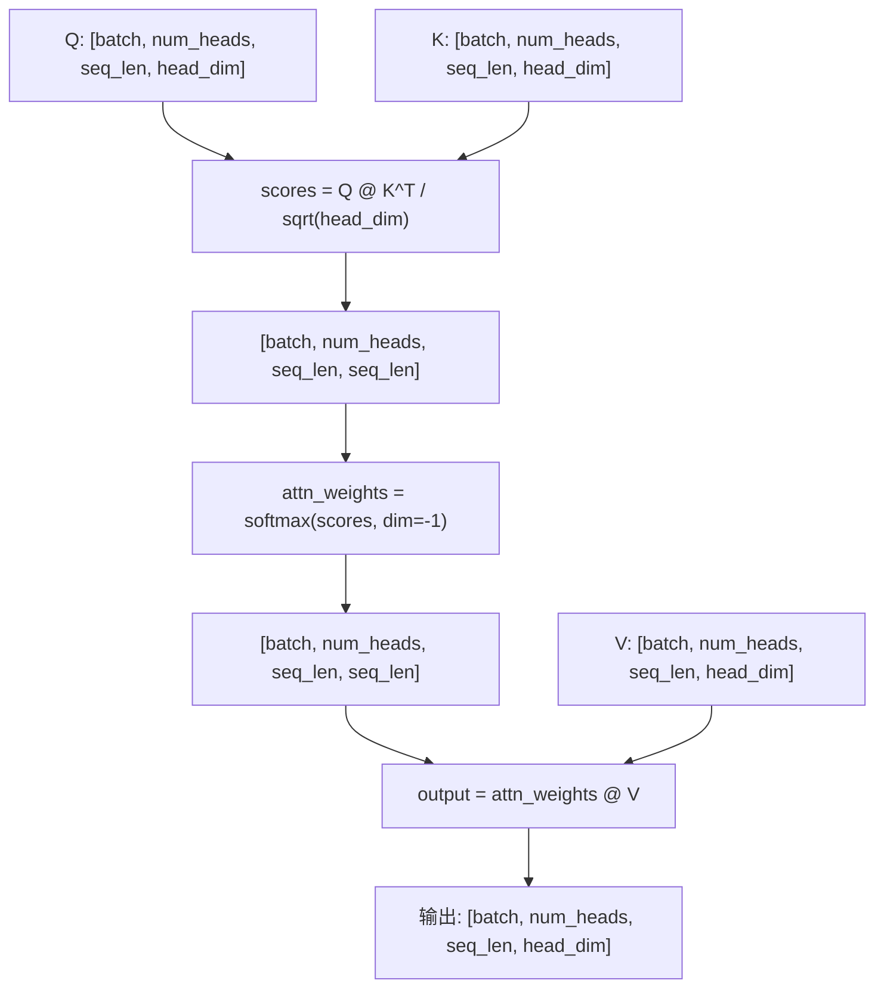

</details>

**代码：[ScaledDotProductAttention.py](attention/ScaledDotProductAttention.py)**

### Multi-Head Attention

多头注意力把输入投影到多个子空间，每个头独立计算注意力，再拼接并做输出投影：

$$\mathrm{MHA}(Q,K,V)=\mathrm{Concat}(\mathrm{head}_1,\ldots,\mathrm{head}_H)W^O$$

$$\mathrm{head}_i=\mathrm{Attention}(QW_i^Q,KW_i^K,VW_i^V)$$

`model_dim` 必须能被 `num_heads` 整除。输入 `[B,T,D]` 经投影、分头得到
`[B,H,T,D/H]`，合头后恢复 `[B,T,D]`。
`forward(x_query, x_context=None, mask=None)` 中，未传 `x_context` 时执行自注意力，
传入时执行交叉注意力。因果约束由调用者通过 mask 提供，`dropout_p` 默认是 0。

<details>
<summary>张量形状示意</summary>

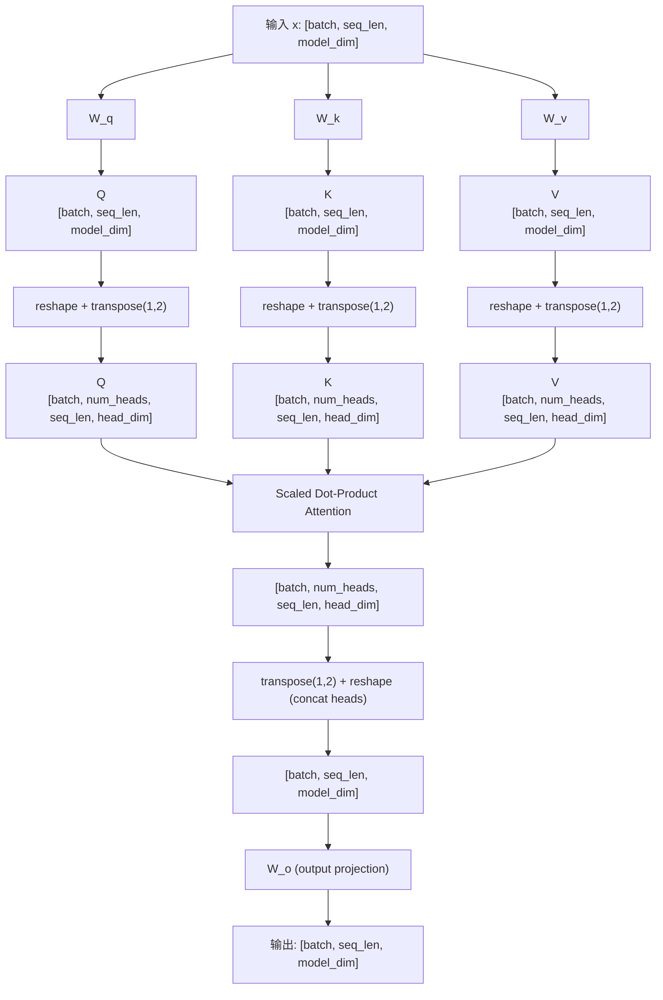

</details>

**代码：[MultiHeadAttention.py](attention/MultiHeadAttention.py)**

### Group Query Attention

分组查询注意力让多个 Query 头共享一组 K/V，以减少 K/V 投影与缓存大小。
设 Query 有 $H$ 个头，K/V 有 $G$ 个头，要求 $H$ 能被 $G$ 整除：

| 类型 | Q 头数 | K/V 头数 | 相同头维度下的 KV 存储比例 |
|---|---|---|---|
| MHA | $H$ | $H$ | $1$ |
| GQA | $H$ | $G$ | $G/H$ |
| MQA | $H$ | $1$ | $1/H$ |

本实现把 `[B,G,T,d]` 的 K/V 按组扩展为 `[B,H,T,d]`，
随后复用缩放点积注意力。每组 Query 共享 K/V，但各自的 Query 和注意力权重仍然不同。

<details>
<summary>张量形状示意</summary>

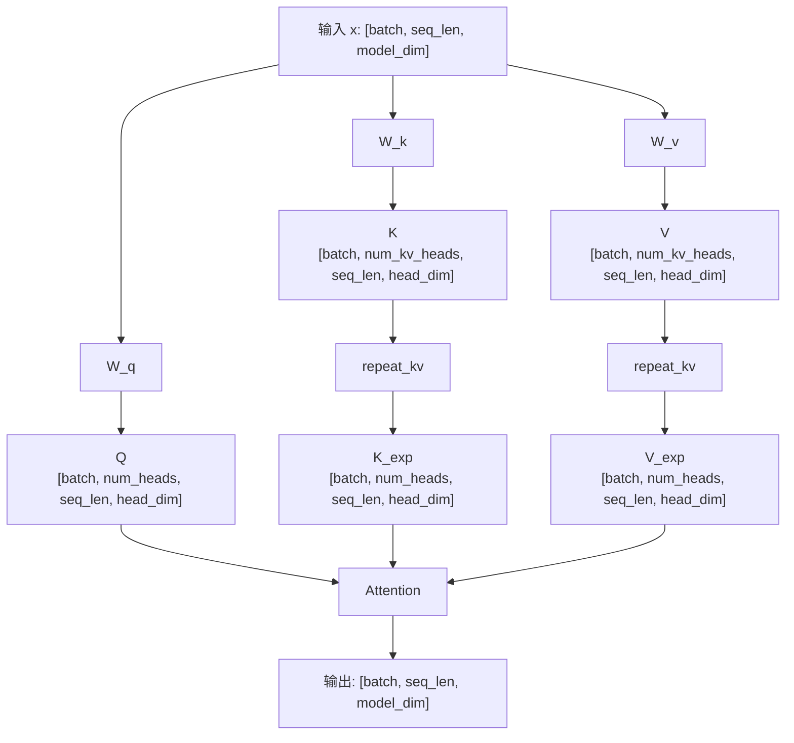

</details>

**代码：[GroupQueryAttention.py](attention/GroupQueryAttention.py)**

### Multi-Head Latent Attention (MLA)

多头潜在注意力通过低秩投影构造 Q、K、V 的中间表示。
KV 路径先下投影到潜空间，再上投影恢复注意力所需的特征：

$$c_{KV}=W_{DKV}h_t,\qquad [k_t,v_t]=W_{UKV}c_{KV}$$

本文件是用于理解张量变换的简化实现：包含 Q/KV 的下投影与上投影，
以及内容特征和 RoPE 特征的拆分、拼接。Q/K 的点积维度为
`head_dim + rope_dim`，V 的头维度为 `head_dim`。

原论文中的共享解耦 RoPE Key、投影吸收和增量潜变量缓存未在此实现；
该文件中的低维中间表示不能直接视为已实现的 KV Cache。

<details>
<summary>张量形状示意</summary>

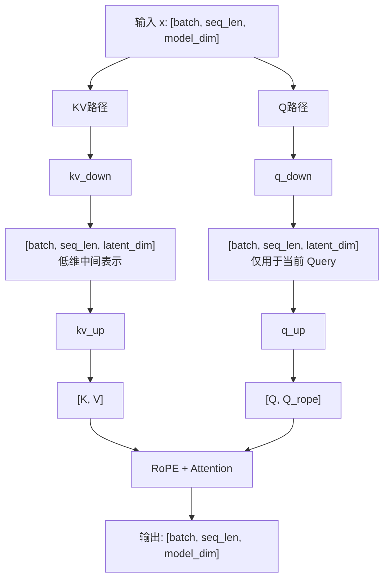

</details>

**代码：[MultiLatentAttention.py](attention/MultiLatentAttention.py)**

### Attention Mask

Padding mask 屏蔽补齐位置，causal mask 屏蔽未来位置。合并时使用逻辑与，
形状 `[B,1,Q,K]` 可广播到所有注意力头。本仓库统一使用
**True / 1 = 允许注意，False / 0 = 屏蔽**。

```python
import torch
from attention.AttentionMask import create_attention_mask

input_ids = torch.tensor([[11, 12, 13, 0]])
allowed = create_attention_mask(input_ids, pad_token_id=0)
# [B, 1, Q, K]：屏蔽未来 token、padding key 和 padding query。
```

缓存解码时，Query 的绝对位置从 `past_len` 开始，允许条件是：

$$k_{position}\le past\_len+q_{position}$$

例如已缓存 3 个 token，本轮输入 2 个 token，则 mask 为 `Q=2, K=5`：
第一行允许前 4 个 key，第二行允许全部 5 个 key。
`create_attention_mask` 的 `input_ids` 应包含历史与当前输入，
`query_len` 表示本轮长度，`past_len` 表示缓存长度。
默认同时屏蔽 padding query；可通过 `mask_query_padding=False` 只屏蔽 padding key。

**代码：[AttentionMask.py](attention/AttentionMask.py)**

### KV Cache

自回归生成时，旧 token 的 K/V 不变。缓存它们后，每轮只计算新 token 的 Q/K/V，
再把新 K/V 沿序列维追加到缓存，避免重复投影历史 token。

`forward(x, past_key_value=None, mask=None)` 返回 `(output, (K, V))`，
缓存形状为 `[B,H,T,d]`。支持首轮 prefill、逐 token decode 和分块 decode，
内部自动构造带位置偏移的因果 mask。

```python
import torch
from attention.MultiHeadAttentionWithKVCache import MultiHeadAttentionWithKVCache

model = MultiHeadAttentionWithKVCache(model_dim=8, num_heads=2).eval()
x = torch.randn(1, 4, 8)
with torch.no_grad():
    full, _ = model(x)
    first, cache = model(x[:, :3])
    last, cache = model(x[:, 3:], past_key_value=cache)
    torch.testing.assert_close(torch.cat([first, last], dim=1), full)
```

缓存中的 K 已应用其位置的 RoPE；追加时仅旋转本轮新 Q/K，
位置偏移设为历史长度，旧 K 不再旋转。

**代码：[MultiHeadAttentionWithKVCache.py](attention/MultiHeadAttentionWithKVCache.py)**


## 归一化层

### LayerNorm

LayerNorm 对每个位置的特征维度归一化，不依赖 batch 内的其他样本：

$$\mu=\frac1d\sum_i x_i,\qquad \sigma^2=\frac1d\sum_i(x_i-\mu)^2$$

$$\mathrm{LN}(x)=\gamma\frac{x-\mu}{\sqrt{\sigma^2+\epsilon}}+\beta$$

输入和输出均为 `[..., d]`，均值与方差保持最后一维为 1，以便广播。
方差使用总体方差，即 `unbiased=False`；$\gamma$ 和 $\beta$ 分别是可学习的缩放与偏移。
FP16 / BF16 的统计量在 FP32 中计算，FP64 输入保留双精度。

<details>
<summary>张量形状示意</summary>

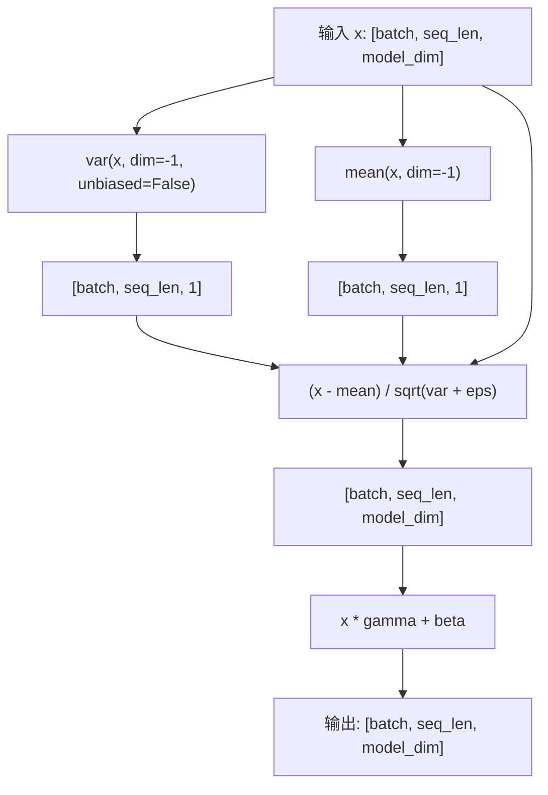

</details>

**代码：[LayerNorm.py](normalization/LayerNorm.py)**

### RMSNorm

RMSNorm 用均方根缩放特征，不减去均值：

$$\mathrm{RMSNorm}(x)=\gamma\frac{x}{\sqrt{\frac1d\sum_i x_i^2+\epsilon}}$$

与 LayerNorm 相比，它省去中心化步骤，只使用可学习缩放 $\gamma$，不包含偏移 $\beta$。
输入与输出形状相同；FP16 / BF16 统计量提升到 FP32，FP64 输入保留双精度。

<details>
<summary>张量形状示意</summary>

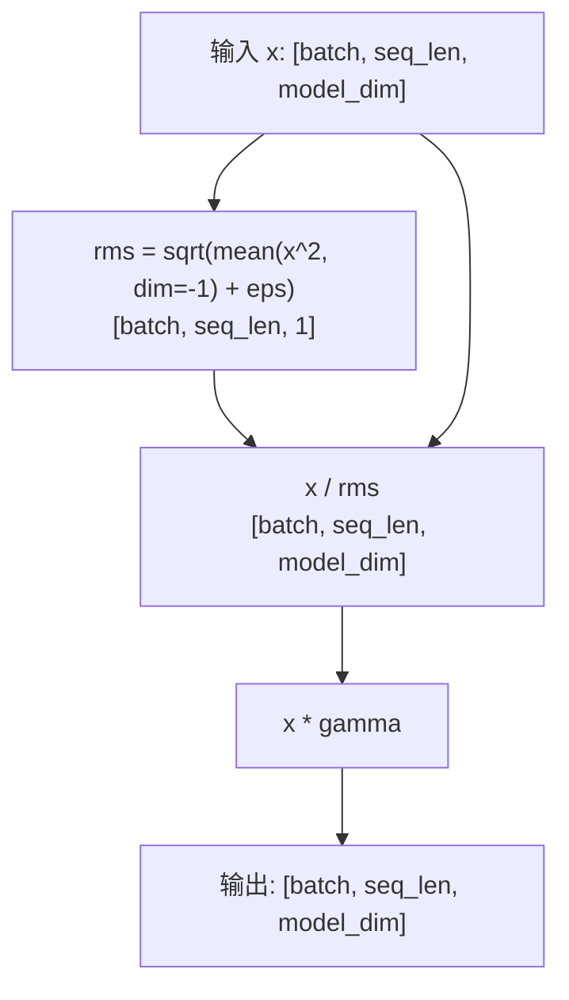

</details>

**代码：[RMSNorm.py](normalization/RMSNorm.py)**


## 位置编码

### Rotary Position Embedding (RoPE)

RoPE 将位置信息编码为 Q/K 特征对的旋转。位置 $m$、频率 $\theta_i$ 的变换为：

$$\begin{aligned}
x_1'&=x_1\cos(m\theta_i)-x_2\sin(m\theta_i)\\
x_2'&=x_1\sin(m\theta_i)+x_2\cos(m\theta_i)
\end{aligned}$$

$$\theta_i=10000^{-2i/d}$$

两个位置的旋转向量做点积时，旋转角度的差与相对位置有关。
本实现按前后半区配对，使用 `x * cos + rotate_half(x) * sin`，
其中 `rotate_half(x) = [-x后半, x前半]`，因此头维度必须为偶数。

`forward(xq, xk, offset=0)` 接收 `[B,T,H,d]` 的 Q/K。
缓存解码使用 `offset=past_len`，频率表按需要扩展。
能够计算更大位置上的旋转，不代表模型在超出训练长度后仍能保持质量。

<details>
<summary>张量形状示意</summary>

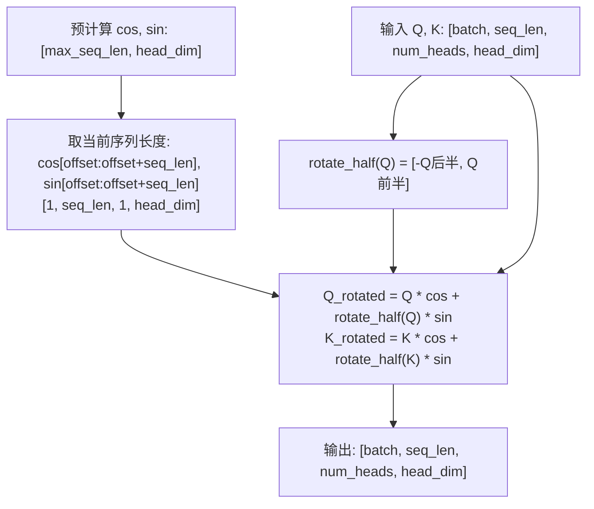

</details>

**代码：[RotaryEmbedding.py](position/RotaryEmbedding.py)**


## 前馈网络

### FFN

前馈网络在每个 token 位置上独立进行两次线性变换，加入非线性激活：

$$\mathrm{FFN}(x)=W_2\mathrm{ReLU}(W_1x+b_1)+b_2$$

形状依次为 `[B,T,D] → [B,T,I] → [B,T,D]`，中间维度 $I$ 通常大于 $D$。
本实现使用带 bias 的两层线性层，中间维度由 `intermediate_dim` 指定，常见取值为 `4 * model_dim`。

<details>
<summary>张量形状示意</summary>

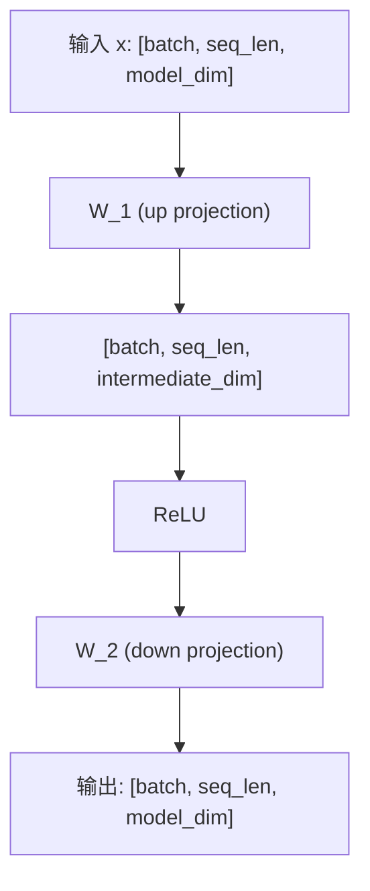

</details>

**代码：[FFN.py](ffn/FFN.py)**

### SwiGLU

SwiGLU 用 SiLU 门控分支调节另一条特征分支，再通过下投影恢复模型维度：

$$\mathrm{SwiGLU}(x)=W_{down}\left(\mathrm{SiLU}(W_{gate}x)\odot W_{up}x\right)$$

两条上投影分支均产生 `[B,T,I]`，逐元素相乘后下投影到 `[B,T,D]`。
本实现有 gate、up、down 三个无 bias 矩阵。比较它与 FFN 的参数量时，
应同时考虑中间维度：同样的 $I$ 下，SwiGLU 比双矩阵 FFN 多一个投影。
忽略 bias，FFN 的 $I=4D$ 时参数量约为 $8D^2$；SwiGLU 取 $I\approx8D/3$ 可对齐参数量。

<details>
<summary>张量形状示意</summary>

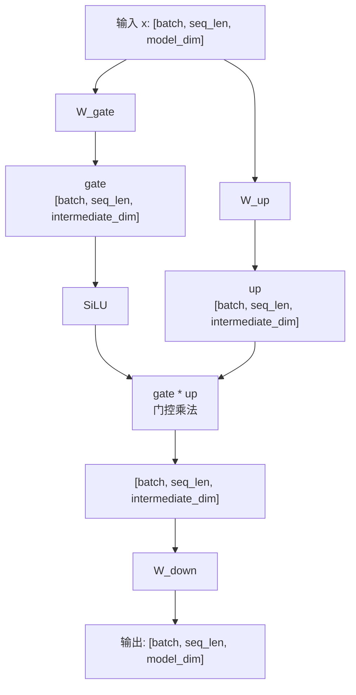

</details>

**代码：[SwiGLUFFN.py](ffn/SwiGLUFFN.py)**

### Mixture of Experts

MoE 通过 Router 为每个 token 选择少量专家，扩大总参数容量，同时控制激活计算量。
设路由 logits 为 $g(x)$，选中的专家集合为 $S=\mathrm{TopK}(g(x))$：

$$w_i=\frac{e^{g_i(x)}}{\sum_{j\in S}e^{g_j(x)}},\qquad
\mathrm{MoE}(x)=\sum_{i\in S}w_iE_i(x)$$

本实现先取 Top-k logits，再在选中专家之间做 softmax，权重和为 1。
输入展平为 `[B*T,D]`，分派给专家后按权重累加，最后恢复 `[B,T,D]`。
这里的 Top-k 是专家路由；生成采样中的 Top-k 则是在词表中筛选候选 token。
当前归一化方式在 `top_k=1` 时权重恒为 1，任务损失对 Router 的梯度为零；
训练这种路由配置需额外设计路由权重或辅助目标。

<details>
<summary>张量形状示意</summary>

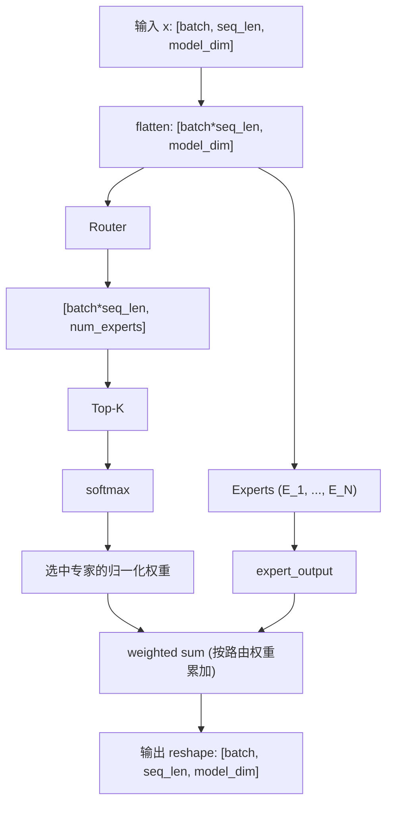

</details>

**代码：[MoE.py](ffn/MoE.py)**


## 损失函数

### Cross Entropy

硬标签交叉熵取目标类别的负 log 概率；软标签交叉熵计算目标分布的加权和：

$$\mathrm{CE}(z,y)=-\log\mathrm{softmax}(z)_y$$

$$\mathrm{CE}(z,q)=-\sum_j q_j\log\mathrm{softmax}(z)_j$$

`cross_entropy_loss(logits, targets, reduction="mean", ignore_index=-100)` 的
logits 为 `[..., C]`。硬标签为 `[...]` 的整数类别索引，
软标签为 `[..., C]` 的非负概率分布，每行总和为 1。

`mean` 对有效位置取平均，`sum` 求和，`none` 保留位置维度。
被忽略的硬标签不参与损失和梯度；全忽略时返回可反传的零损失。

**代码：[EntropyLoss.py](loss/EntropyLoss.py)**

### Pretrain Loss

因果语言模型用当前位置的 logits 预测下一个 token，先做 next-token shift：
`logits[:, :-1, :]` 对齐 `labels[:, 1:]`。

$$\mathcal L_{pretrain}=-\frac1N\sum_{b,t}m_{bt}\log P(x_{b,t+1}\mid x_{b,\le t})$$

$m$ 标记 shift 后的有效标签，$N=\sum m$。`PretrainLoss` 忽略 `-100`，
按有效 token 数取平均；全忽略时返回零损失。
输入 logits 为 `[B,T,V]`，labels 为 `[B,T]`。

<details>
<summary>张量形状示意</summary>

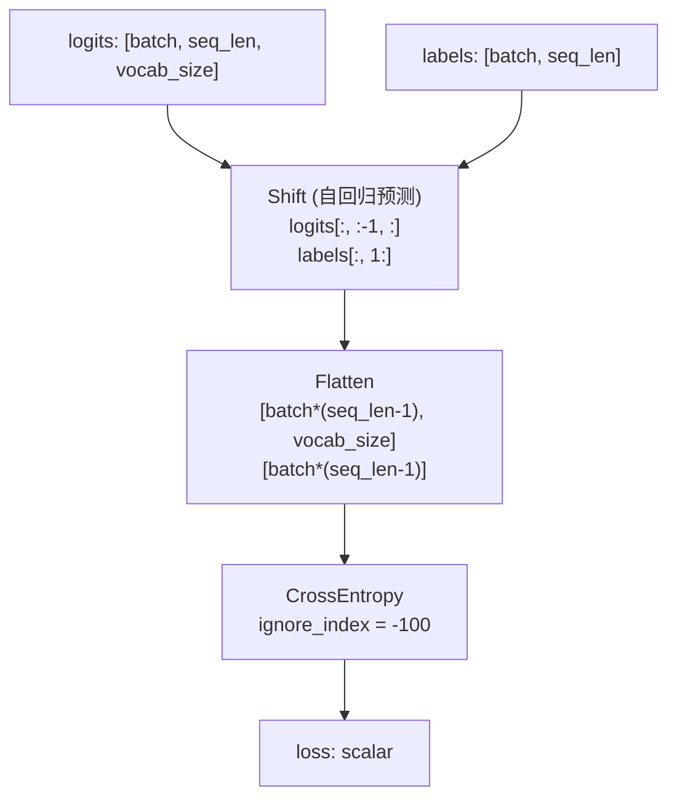

</details>

**代码：[PretainLoss.py](loss/PretainLoss.py)**

### SFT Loss

监督微调通常只训练 response 部分。它与预训练共享 shift 和交叉熵计算，
差别在于先把 prompt 对应的 label 设为 `-100`，保留原有 padding 忽略标记：

$$\mathcal L_{SFT}=-\frac1{N_{response}}\sum_{b,t}m^{response}_{bt}
\log P(x_{b,t+1}\mid x_{b,\le t})$$

非空 prompt 的长度为 $p\ge1$ 时，使用从零开始的下标，首个 response token 位于 `labels[:, p]`，
由 `logits[:, p-1, :]` 预测。因此应先屏蔽原始 labels，再做 shift，避免错位。
最终按有效 response token 数取平均，全忽略时返回零损失。

<details>
<summary>张量形状示意</summary>

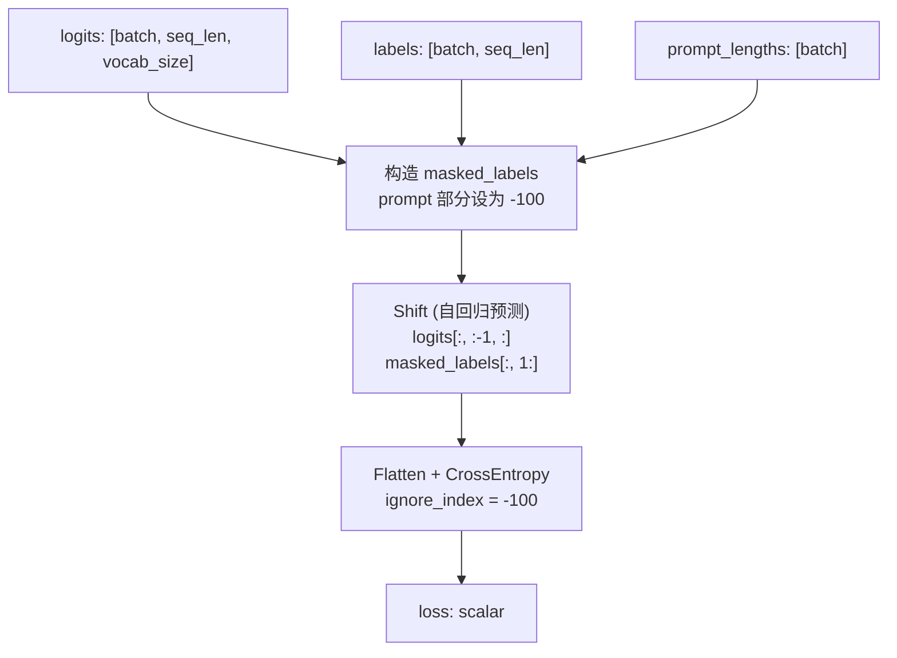

</details>

**代码：[SFTLoss.py](loss/SFTLoss.py)**

### InfoNCE Loss

InfoNCE 用正样本与批内负样本训练特征。输入两组 `[B,D]` 向量，
第 $i$ 对是正样本，其他配对是负样本。归一化后计算余弦相似度：

$$s_{ij}=\frac{\langle\hat q_i,\hat k_j\rangle}{\tau},\qquad
\mathcal L=-\frac1B\sum_i\log\frac{e^{s_{ii}}}{\sum_j e^{s_{ij}}}$$

分母包含正样本。`info_nce_loss(queries, keys, temperature=0.1, symmetric=False)`
等价于对相似度矩阵做交叉熵，目标类别为 `arange(B)`。
温度必须为有限正数；`symmetric=True` 平均两个方向的损失。`B=1` 时损失为零。

**代码：[InfoNCELoss.py](loss/InfoNCELoss.py)**

### DPO Loss

直接偏好优化利用同一 prompt 的 chosen / rejected 回答，
提高当前策略相对参考策略对 chosen 的偏好：

$$\Delta=\left(\log\pi_\theta(y_w|x)-\log\pi_{ref}(y_w|x)\right)
-\left(\log\pi_\theta(y_l|x)-\log\pi_{ref}(y_l|x)\right)$$

$$\mathcal L_{DPO}=-\mathbb E[\log\sigma(\beta\Delta)]$$

输入是策略与参考模型、chosen 与 rejected 共四组 `[B]` 序列 log 概率，
需在调用前对回答的有效 token 聚合。$\beta$ 控制相对参考策略的约束强度。
实现使用 `logsigmoid` 保持数值稳定，并支持标签平滑。

**代码：[DPOLoss.py](loss/DPOLoss.py)**

### PPO Loss

PPO 用裁剪的重要性采样比率限制策略更新。令
$r_t=\exp(\log\pi_{new,t}-\log\pi_{old,t})$：

$$\mathcal L_{PPO}=-\mathbb E\left[\min\left(r_tA_t,
\mathrm{clip}(r_t,1-\epsilon,1+\epsilon)A_t\right)\right]$$

这是供梯度下降最小化的 loss，与最大化的策略目标符号相反。
优势为正且 $r_t>1+\epsilon$ 时，上界截断收益；
优势为负且 $r_t<1-\epsilon$ 时，下界截断收益。
裁剪并不把所有超出区间的比率都强制替换，仍需取两个分支的最小值。

<details>
<summary>裁剪机制示意</summary>

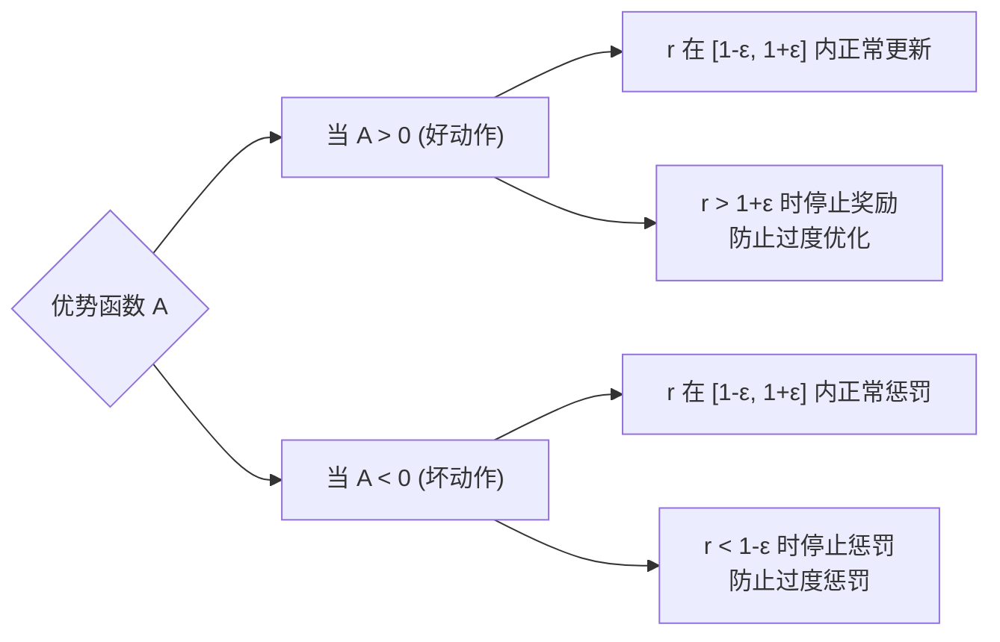

</details>

**代码：[PPOLoss.py](loss/PPOLoss.py)**

### GRPO Loss

GRPO 为同一 prompt 生成多个回答，利用组内相对奖励估计优势：

$$A_i=\frac{R_i-\mathrm{mean}(R)}{\mathrm{std}(R)+\epsilon}$$

`compute_grpo_advantages(rewards)` 接收 `[B,G]` 奖励，
标准差使用总体统计量；单样本组和奖励恒定组的优势为零。
这种组内估计不需要额外的价值网络。

$$\mathcal L_{GRPO}=-\mathrm{mean}\left[\min\left(rA,
\mathrm{clip}(r,1-\epsilon_c,1+\epsilon_c)A\right)\right]
+\beta\,\mathrm{mean}(KL)$$

`grpo_loss(old_log_probs, new_log_probs, advantages, ..., ref_kl=None)`
对同形状输入逐元素计算比率，再取平均；仅在提供 `ref_kl` 时加入 KL 惩罚。
此函数没有 response mask 接口，变长回答的 token / 序列权重应由调用者明确处理。

**代码：[GRPOLoss.py](loss/GRPOLoss.py)**

### DAPO Loss

DAPO 损失使用 token 级重要性比率、非对称裁剪和有效 token 归一化。
定义 $r_{it}=\exp(\log\pi_{new,it}-\log\pi_{old,it})$，$m$ 标记有效 response token：

$$\mathcal L_{DAPO}=-\frac{\sum_{i,t}m_{it}\min\left(r_{it}A_{it},
\mathrm{clip}(r_{it},1-\epsilon_{low},1+\epsilon_{high})A_{it}\right)}{\sum_{i,t}m_{it}}$$

`dapo_loss` 的 old / new log 概率为 `[B,T]`，优势支持 `[B]`、`[B,1]` 或 `[B,T]`。
默认 `epsilon_low=0.2`、`epsilon_high=0.28`。所有有效 token 等权，
长回答因有效 token 更多而贡献更多项；全 mask 时返回零损失。
旧策略概率和优势在内部 detach，梯度流向新策略。

本文件覆盖损失核心，动态采样、超长回答处理和 rollout 系统需由训练流程实现。

**代码：[DAPOLoss.py](loss/DAPOLoss.py)**

### GSPO Loss

GSPO 先计算每条回答的平均 log ratio，再取指数得到序列级比率：

$$s_i=\exp\left(\frac{\sum_t m_{it}(\log\pi_{new,it}-\log\pi_{old,it})}
{\sum_t m_{it}}\right)$$

$$\mathcal L_{GSPO}=-\frac1{B_{valid}}\sum_{i:\,length_i>0}
\min\left(s_iA_i,\mathrm{clip}(s_i,1-\epsilon_{low},1+\epsilon_{high})A_i\right)$$

`gspo_loss` 的 old / new log 概率为 `[B,T]`，优势为 `[B]`。
默认裁剪参数为 `epsilon_low=3e-4`、`epsilon_high=4e-4`；
仅对非空回答等权平均，全 mask 时返回零损失。
旧策略概率和优势在内部 detach。

| 对比 | DAPO | GSPO |
|---|---|---|
| 重要性比率 | 每个 token 的比率 | 平均 log ratio 的指数 |
| 裁剪粒度 | token | 整条回答 |
| 归约权重 | 有效 token 等权 | 非空回答等权 |

$s_i$ 是 token 比率的几何平均，不是比率的算术平均，也不是未按长度归一化的连乘。

**代码：[GSPOLoss.py](loss/GSPOLoss.py)**

### KL Divergence

当已知完整类别分布时，可以精确计算：

$$D_{KL}(P\Vert Q)=\sum_jP_j(\log P_j-\log Q_j)$$

`EntropyLoss.KL_divergence` 对最后一维求和，再对分布取平均，
不是对全部类别元素取平均。

采样估计要求 $x\sim P$，输入 `log_probs = log P(x)`、`ref_log_probs = log Q(x)`。
记 $l=\log Q(x)-\log P(x)$：

$$k_1=-l,\qquad k_2=\tfrac12l^2,\qquad k_3=e^l-1-l$$

`sampled_kl_divergence(..., estimator="k3", mask=None, reduction="mean")`
支持三个估计器与有效位置 mask。k1 的单样本值可为负，期望为 KL；
k2 是局部平方近似，一般有偏；k3 使用控制变量，近零时用 `expm1(l)-l` 减少相消误差。
k1 / k3 的无偏性依赖实际从 P 采样和相应支撑条件。
对采样值直接自动求导，也不自动等于精确 KL 对策略参数的梯度。

**代码：[EntropyLoss.py](loss/EntropyLoss.py) · [KLDivergence.py](loss/KLDivergence.py)**


## 参数高效微调

### LoRA

LoRA 冻结基础权重，在旁路中训练低秩更新：

$$y=W_0x+\frac\alpha rBAx$$

$W_0$ 形状为 `[out_features, in_features]`，
$A$ 为 `[r, in_features]`，$B$ 为 `[out_features, r]`，且 $r$ 远小于输入和输出维度。
A 随机初始化，B 初始化为零，使初始输出与基础线性层相同。
冻结基础权重时仍需保留输入梯度，才能把误差信号传回前层。

推理时可以合并权重：

$$W_{merged}=W_0+\frac\alpha rBA$$

`merged_linear()` 返回独立的合并线性层。
旁路包含 dropout 时，应先切换到 `eval()` 再比较合并前后的输出。

<details>
<summary>张量形状示意</summary>

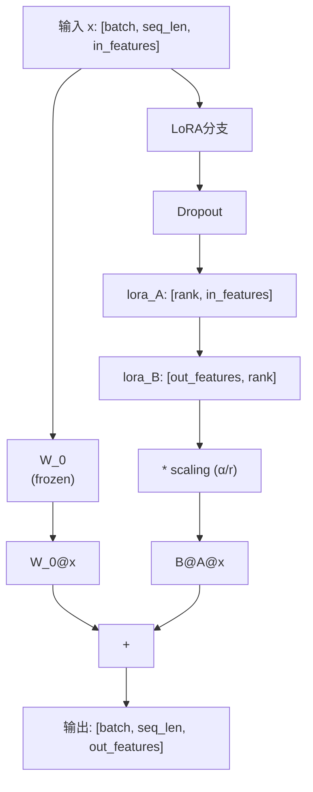

</details>

**代码：[LoRALinear.py](peft/LoRALinear.py)**


## 分词

### Byte-level BPE

Byte-level BPE 从 256 个 UTF-8 byte token 开始，统计相邻 token 对的频率，
反复合并高频对并记录学习顺序。编码时按 merge rank 应用规则，
不是重新按待编码文本中的频率选择合并。

```python
from tokenizer.BPE import ByteBPETokenizer

tokenizer = ByteBPETokenizer().fit(["你好，世界！", "你好，面试！"], num_merges=16)
text = "你好 新词🙂\n"
assert tokenizer.decode(tokenizer.encode(text)) == text
```

基础 byte 词表可表示未见过的中文、英文、空格、换行和 emoji。
单个 byte token 可能不是完整字符，解码时应拼接全部字节后统一进行 UTF-8 解码。
频率并列时使用确定性的规则，训练样本之间不跨边界合并。
该实现包含合并训练、编码与解码；GPT-2 风格的正则预分词和特殊 token 协议需另行实现。

**代码：[BPE.py](tokenizer/BPE.py)**


## 量化

### INT8 量化

量化使用 scale $s$ 与 zero point $z$ 将浮点值映射到整数，再近似恢复：

$$q=\mathrm{clamp}(\mathrm{round}(x/s)+z),\qquad \hat x=(q-z)s$$

| 模式 | 整数范围 | scale | zero point |
|---|---|---|---|
| 对称 | $[-127,127]$ | $\max|x|/127$ | $0$ |
| 非对称 | $[-128,127]$ | $(x_{max}-x_{min})/255$ | 裁剪后的 $\mathrm{round}(-128-x_{min}/s)$ |

非对称模式先把校准范围扩展到包含零。
返回 `Int8Quantized(values, scale, zero_point)`，`values` 真正使用 `torch.int8` 存储。
全零输入使用合法的非零 scale，正 / 负常量也能处理。

量化误差来自舍入和范围裁剪。本文件实现逐张量量化与反量化，
逐通道量化、QAT 和 INT8 矩阵乘 kernel 属于进一步扩展。

**代码：[Quantization.py](components/Quantization.py)**


## 生成

### 生成采样

给定词表 logits，采样依次进行温度缩放、候选过滤和随机抽取：

$$p_i=\mathrm{softmax}(z_i/\tau)$$

1. `temperature` 必须是有限正数；较低温度让分布更集中，较高温度让分布更平缓。
2. `top_k` 保留指定数量的候选，`None` 表示不限制。
3. `top_p` 按概率降序累计，保留首次达到阈值的最小前缀。
4. 对过滤后的 logits 做 softmax，再用 multinomial 抽样。

跨过 top-p 阈值的 token 必须保留，至少留下一个候选。
`filter_logits` 返回过滤结果且不修改输入；
`sample_logits` 返回 `logits.shape[:-1]` 的 token IDs。
`greedy=True` 使用 argmax；传入 `torch.Generator` 可复现随机结果。
允许用 `-inf` 禁止某个 token，NaN、`+inf` 或整行无候选会报错。

**代码：[Sampling.py](generation/Sampling.py)**


## 工具调用

### 流式参数解析

工具调用参数会以 JSON 片段分批到达，多条调用也可能交错。
解析器按调用索引分别维护状态，处理三类事件：

1. `response.output_item.added` 注册调用信息。
2. `response.function_call_arguments.delta` 追加参数片段。
3. `response.function_call_arguments.done` 完成参数并验证 JSON object。

`output_index` 区分交错调用，`item_id` 校验归属。
`ToolCallParser.feed(event)` 返回刚完成的调用或 `None`，
`finish()` 检查流是否完整；`parse_tool_calls(events)` 返回按索引排序的 `ToolCall` 列表，
包含调用 ID、名称与解析后的参数字典。

错误 JSON、未知索引、重复完成和未结束的调用都会报错。
解析器生成结构化调用信息，工具执行由调用者负责。

**代码：[ToolCallParser.py](tools/ToolCallParser.py)**

## 参考文献

<details>
<summary>展开参考论文</summary>

**注意力机制**

- [Attention Is All You Need](https://arxiv.org/abs/1706.03762) - Transformer / MHA
- [GQA: Training Generalized Multi-Query Transformer Models](https://arxiv.org/abs/2305.13245) - GQA
- [DeepSeek-V2](https://arxiv.org/abs/2405.04434) - MLA

**位置编码**

- [RoFormer: Rotary Position Embedding](https://arxiv.org/abs/2104.09864) - RoPE

**归一化**

- [Layer Normalization](https://arxiv.org/abs/1607.06450)
- [Root Mean Square Layer Normalization](https://arxiv.org/abs/1910.07467)

**前馈网络**

- [GLU Variants Improve Transformer](https://arxiv.org/abs/2002.05202) - SwiGLU
- [Outrageously Large Neural Networks: The Sparsely-Gated Mixture-of-Experts Layer](https://arxiv.org/abs/1701.06538) - MoE
- [Mixtral of Experts](https://arxiv.org/abs/2401.04088) - MoE

**训练方法**

- [Direct Preference Optimization](https://arxiv.org/abs/2305.18290) - DPO
- [Proximal Policy Optimization](https://arxiv.org/abs/1707.06347) - PPO
- [DeepSeekMath](https://arxiv.org/abs/2402.03300) - GRPO
- [DeepSeek-R1](https://arxiv.org/abs/2501.12948) - GRPO
- [DAPO](https://arxiv.org/abs/2503.14476) - 非对称 clipping 与 token 归一化
- [Group Sequence Policy Optimization](https://arxiv.org/abs/2507.18071) - GSPO
- [Representation Learning with Contrastive Predictive Coding](https://arxiv.org/abs/1807.03748) - InfoNCE
- [Approximating KL Divergence](http://joschu.net/blog/kl-approx.html) - k1 / k2 / k3

**参数高效微调**

- [LoRA: Low-Rank Adaptation](https://arxiv.org/abs/2106.09685)

</details>
