# LLM 面试手撕代码大全

> 大模型面试必备：从注意力机制到强化学习，从零实现核心组件

[]()
[]()

本地增补版基于 [ckd0817/LLM-Interview-Code](https://github.com/ckd0817/LLM-Interview-Code)
的 `820ce2b`，对照 [AIR-hl/llm-interview-code](https://github.com/AIR-hl/llm-interview-code)
的题目范围补齐实现，并增加数值、梯度和边界测试。

## 快速开始

在仓库根目录执行，Python 3.10+。Windows PowerShell：

```powershell
python -m venv .venv
.\.venv\Scripts\python.exe -m pip install torch --index-url https://download.pytorch.org/whl/cpu
.\.venv\Scripts\python.exe -m pip install -r requirements-dev.txt
.\.venv\Scripts\python.exe -m pytest -q
.\.venv\Scripts\python.exe -m examples.quickstart
```

Linux / macOS 可将上述 Python 路径替换为 `.venv/bin/python`。
核心依赖只有 PyTorch；BPE 与工具调用解析使用 Python 标准库。
PPO 绘图示例需要另外安装 `matplotlib`，导入损失函数时不需要它。

按练习顺序阅读 [手撕题学习清单](docs/INTERVIEW_GUIDE.md)，新增范围见下表。

| 主题 | 实现入口 | 本次补充 |
|---|---|---|
| 缓存注意力 | [MultiHeadAttentionWithKVCache.py](attention/MultiHeadAttentionWithKVCache.py) | prefill、逐 token / 分块 decode、RoPE offset |
| 掩码 | [AttentionMask.py](attention/AttentionMask.py) | padding、causal、缓存位置偏移与合并 |
| 线性层 | [Linear.py](components/Linear.py) | 手写参数、矩阵乘与 bias |
| 激活 | [Activation.py](components/Activation.py) | 手写 Sigmoid、SiLU |
| BPE | [BPE.py](tokenizer/BPE.py) | byte-level 合并训练、编码与解码 |
| 对比学习 | [InfoNCELoss.py](loss/InfoNCELoss.py) | 批内负样本、温度与对称损失 |
| 量化 | [Quantization.py](components/Quantization.py) | 对称 / 非对称 INT8、反量化、常量边界 |
| 生成采样 | [Sampling.py](generation/Sampling.py) | greedy、temperature、top-k、top-p |
| 工具调用 | [ToolCallParser.py](tools/ToolCallParser.py) | 交错流事件、增量 JSON 参数解析 |
| DAPO | [DAPOLoss.py](loss/DAPOLoss.py) | 非对称 clipping、有效 token 归一化 |
| GSPO | [GSPOLoss.py](loss/GSPOLoss.py) | 序列级比率与 clipping |
| KL 估计 | [KLDivergence.py](loss/KLDivergence.py) | k1 / k2 / k3 采样估计 |
| 交叉熵 | [EntropyLoss.py](loss/EntropyLoss.py) | 硬标签、软标签与数值稳定性 |

本仓库是教学实现。DAPO / GSPO 文件覆盖损失核心，DAPO 的动态采样、
超长样本处理等训练系统功能需结合原论文和框架实现。

## 目录

- [项目简介](#项目简介)
- [项目结构](#项目结构)
- [注意力机制](#注意力机制)
  - [Scaled Dot-Product Attention](#scaled-dot-product-attention)
  - [Multi-Head Attention](#multi-head-attention)
  - [Group Query Attention](#group-query-attention)
  - [Multi-Latent Attention](#multi-latent-attention)
- [归一化层](#归一化层)
  - [LayerNorm](#layernorm)
  - [RMSNorm](#rmsnorm)
- [位置编码](#位置编码)
  - [Rotary Position Embedding (RoPE)](#rotary-position-embedding-rope)
- [前馈网络](#前馈网络)
  - [FFN](#ffn)
  - [SwiGLU](#swiglu)
  - [Mixture of Experts](#mixture-of-experts)
- [损失函数](#损失函数)
  - [Pretrain Loss](#pretrain-loss)
  - [SFT Loss](#sft-loss)
  - [DPO Loss](#dpo-loss)
  - [PPO Loss](#ppo-loss)
  - [GRPO Loss](#grpo-loss)
  - [DAPO / GSPO / InfoNCE / KL](#新增损失函数)
- [参数高效微调](#参数高效微调)
  - [LoRA](#lora)
- [参考文献](#参考文献)

## 项目简介

本项目收录了大语言模型（LLM）面试中高频出现的手撕代码实现，涵盖：

- **注意力机制**：MHA、GQA、MLA 等现代注意力变体
- **归一化层**：LayerNorm、RMSNorm
- **位置编码**：RoPE 旋转位置编码
- **前馈网络**：FFN、SwiGLU、MoE
- **损失函数**：Pretrain、SFT、DPO、PPO、GRPO 等训练损失
- **参数高效微调**：LoRA

**项目特色**：
- 使用 PyTorch 核心算子实现，不依赖 Transformers 等高层组件
- 详细注释，张量形状图解
- 公式推导，原理解析
- 对照参考实现检查数值与梯度，验证缓存解码与边界输入

---

## 写给深度学习初学者

初学深度学习时，我常感到困惑：为什么对相同的张量做同样的操作，得到的结果却不同？比如 Q、K、V 三个矩阵的形成过程，代码完全一致，却产生不同的表达。

后来我逐渐理解：**张量操作的代码是相同的，但运行时权重矩阵的参数不同**。这些参数的更新由反向传播自动完成，我们无法直接控制。如果想深入了解参数是如何形成的，需要学习反向传播的原理。我们能做的是学会正确操作张量，设计合理的计算图，让反向传播按照预期方向更新参数。

仔细观察这些代码，你会发现**它们大多是在进行维度变化和对齐的操作**——reshape、transpose、expand、concatenate……掌握这些操作，就能理解数据在网络中是如何流动的。

因此，练习这些 LLM 组件时，需要同时理解张量操作、数学定义和梯度流向。
能够写出正确的形状变换，还要解释 mask、归一化、损失缩放与数值稳定性，
并通过小样本检验实现。**张量操作是理解这一切的基础**。

为此，我专门准备了一个教程：[PyTorch 张量变换与重塑教程](pytorch_tensor_reshape.ipynb)

---

## 项目结构

```
LLM-Interview-Code/
├── attention/                     # 注意力机制
│   ├── ScaledDotProductAttention.py
│   ├── MultiHeadAttention.py
│   ├── GroupQueryAttention.py
│   ├── MultiLatentAttention.py
│   ├── MultiHeadAttentionWithKVCache.py
│   └── AttentionMask.py
├── components/                    # 从零实现的基础组件
│   ├── Linear.py
│   ├── Activation.py
│   └── Quantization.py
├── normalization/                 # 归一化层
│   ├── LayerNorm.py
│   └── RMSNorm.py
├── position/                      # 位置编码
│   └── RotaryEmbedding.py
├── ffn/                           # 前馈网络
│   ├── FFN.py
│   ├── SwiGLUFFN.py
│   └── MoE.py
├── loss/                          # 损失函数
│   ├── SFTLoss.py
│   ├── DPOLoss.py
│   ├── PPOLoss.py
│   ├── GRPOLoss.py
│   ├── PretainLoss.py
│   ├── EntropyLoss.py
│   ├── InfoNCELoss.py
│   ├── KLDivergence.py
│   ├── DAPOLoss.py
│   └── GSPOLoss.py
├── peft/                          # 参数高效微调
│   └── LoRALinear.py
├── tokenizer/BPE.py               # byte-level BPE
├── generation/Sampling.py         # 生成采样
├── tools/ToolCallParser.py         # 工具调用流式解析
├── examples/quickstart.py          # 可运行的练习示例
├── tests/                         # 数值、梯度和回归验证
├── docs/INTERVIEW_GUIDE.md         # 练习顺序、公式与关键边界
├── requirements.txt
├── requirements-dev.txt
├── pyproject.toml
├── pytorch_tensor_reshape.ipynb   # PyTorch 张量操作教程
└── README.md
```

---

## 注意力机制

> **实现说明**
> 本仓库里的注意力模块默认使用 `dropout_p=0.0`，更贴近近两年主流 decoder-only LLM 的常见配置。
> 如果你是为了讲解经典 Transformer 正则化，或者在小数据训练中想显式增加随机性，可以手动传入非零 dropout。

本仓库 attention mask 统一约定为 **True / 1 = 允许注意，False / 0 = 屏蔽**。
缓存解码时 query 的绝对位置从 `past_len` 开始，不能直接套用从零开始的方形下三角 mask。

### Scaled Dot-Product Attention

#### 背景与动机

缩放点积注意力（Scaled Dot-Product Attention）是所有注意力机制的基础。它计算 Query 和 Key 的点积，除以缩放因子后通过 softmax 得到注意力权重，最后加权求和 Value。

这是理解多头注意力的前提，也是面试中最常考的基础版本。

#### 核心公式

$$\text{Attention}(Q, K, V) = \text{softmax}\left(\frac{QK^T}{\sqrt{d_k}}\right)V$$

**为什么需要缩放？**
- 当 $d_k$ 较大时，点积结果也会很大
- 过大的值进入 softmax 后会导致梯度消失
- 除以 $\sqrt{d_k}$ 使方差稳定在 1 附近

#### 张量形状流程图

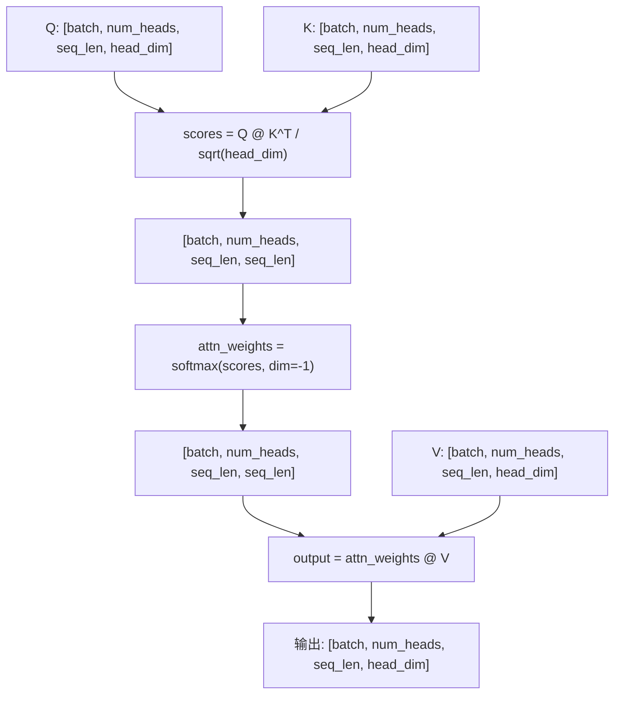

---

### Multi-Head Attention

#### 背景与动机

多头注意力（Multi-Head Attention, MHA）通过将输入映射到多个子空间并行计算注意力，模型可以同时关注不同位置的不同表示子空间信息。

每个头学习不同的注意力模式，最后拼接并通过输出投影融合。

#### 核心公式

$$\text{MultiHead}(Q, K, V) = \text{Concat}(\text{head}_1, ..., \text{head}_h)W^O$$

其中 $\text{head}_i = \text{Attention}(QW_i^Q, KW_i^K, VW_i^V)$

#### 张量形状流程图

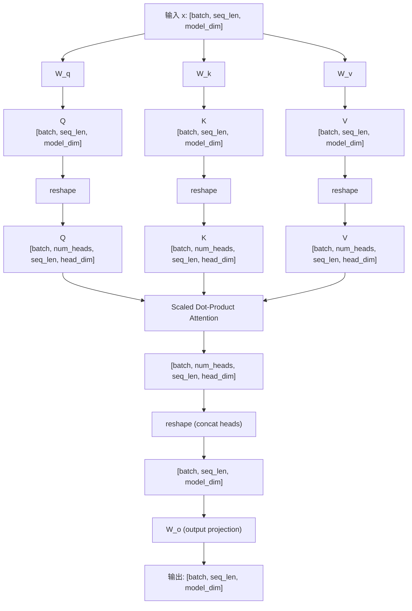

---

### Group Query Attention

#### 背景与动机

分组查询注意力（Grouped Query Attention, GQA）是 MHA 和 Multi-Query Attention (MQA) 的折中方案。在 GQA 中，Query 有 H 个头，而 Key 和 Value 只有 G 个头（G < H），多组 Query 共享同一组 K/V。

这显著减少了 KV Cache 的显存占用，同时保持了较好的模型质量。LLaMA 2、LLaMA 3 等模型都采用了 GQA。

**对比**：
| 类型 | Q 头数 | K 头数 | V 头数 | KV Cache |
|------|--------|--------|--------|----------|
| MHA | H | H | H | 100% |
| GQA | H | G | G | G/H × 100% |
| MQA | H | 1 | 1 | 1/H × 100% |

#### 核心公式

与 MHA 相同，但 K、V 需要通过 `repeat_kv` 扩展到与 Q 相同的头数：

```
K_expanded = repeat(K, num_heads // num_kv_heads)
V_expanded = repeat(V, num_heads // num_kv_heads)
```

#### 张量形状流程图

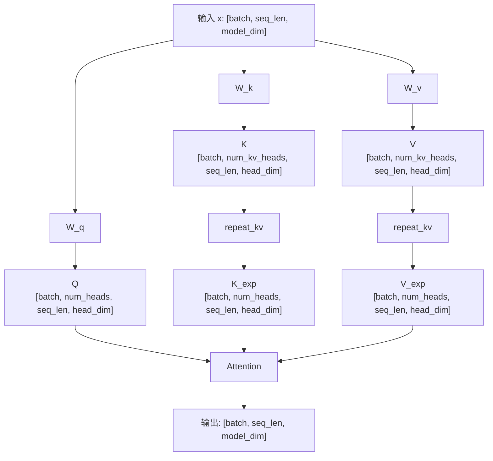

---

### Multi-Latent Attention

> **实现说明**
> `MultiLatentAttention.py` 是用于讲解核心张量变换的简化版 MLA：保留 Q/KV
> 低秩投影与 RoPE 注意力主线，但未实现原论文中的共享解耦 RoPE Key、
> 投影吸收和增量 KV Cache 接口。

#### 背景与动机

多潜变量注意力（Multi-Latent Attention, MLA）由 DeepSeek-V2 提出，通过将 KV 压缩到低维潜空间来大幅减少 KV Cache。与 GQA 不同，MLA 不是通过减少头数，而是通过降维压缩来实现内存节省。

**核心思想**：
- KV 先通过下投影压缩到潜空间（存入 Cache）
- 计算注意力时再上投影恢复
- 压缩比可达 90%+，同时保持性能

#### 核心公式

**KV 压缩**（下投影到潜空间）：

$$c_{KV} = W_{DKV} \cdot h_t$$

**KV 恢复**（上投影恢复 K、V）：

$$[k_{t}, v_{t}] = W_{UKV} \cdot c_{KV}$$

#### 张量形状流程图

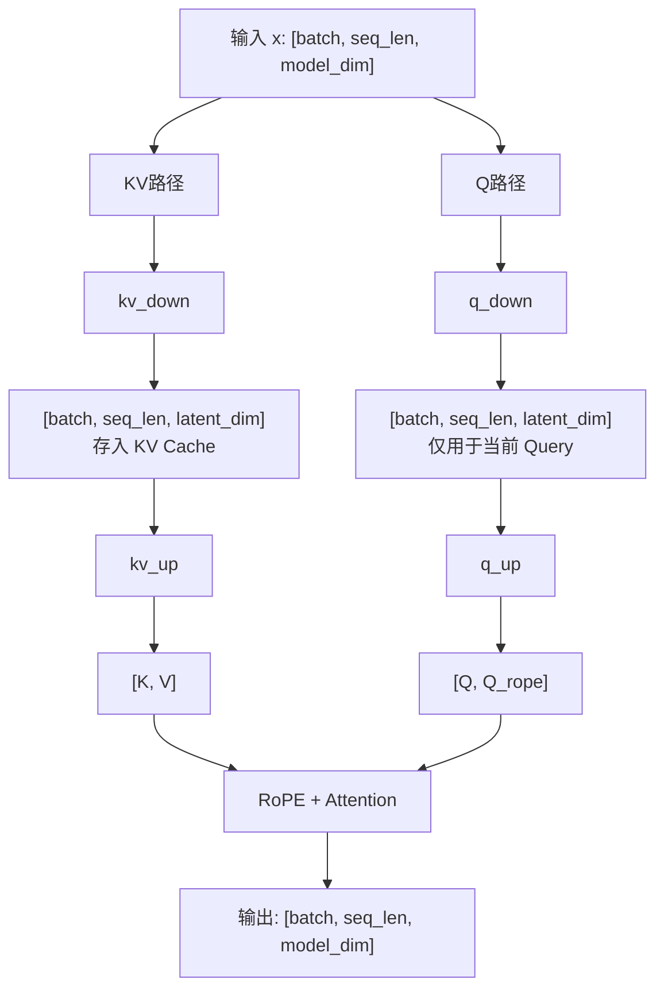

---

## 归一化层

### LayerNorm

#### 背景与动机

层归一化（Layer Normalization）在每个样本的特征维度上进行归一化，使得训练更加稳定。与 BatchNorm 不同，LayerNorm 不依赖 batch size，因此更适合序列模型和 Transformer。

#### 核心公式

$$\text{LN}(x) = \gamma \cdot \frac{x - \mu}{\sqrt{\sigma^2 + \epsilon}} + \beta$$

其中：
- $\mu = \frac{1}{d}\sum_{i=1}^{d} x_i$ （均值）
- $\sigma^2 = \frac{1}{d}\sum_{i=1}^{d} (x_i - \mu)^2$ （方差）
- $\gamma, \beta$：可学习的缩放和偏移参数

#### 张量形状流程图

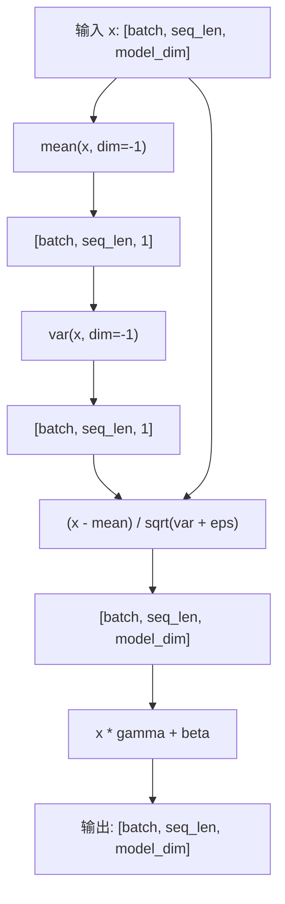

---

### RMSNorm

#### 背景与动机

均方根归一化（Root Mean Square Normalization）是 LayerNorm 的简化版本。它移除了均值计算，只使用 RMS 进行归一化。这种方法计算更快，且在很多 LLM（如 LLaMA、Mistral）中表现优异。

#### 核心公式

$$\text{RMSNorm}(x) = \gamma \cdot \frac{x}{\sqrt{\frac{1}{d}\sum_{i=1}^{d} x_i^2 + \epsilon}}$$

**与 LayerNorm 的区别**：
- 不计算均值（去中心化）
- 只有一个可学习参数 $\gamma$（无 $\beta$）
- 计算量更少，推理更快

#### 张量形状流程图

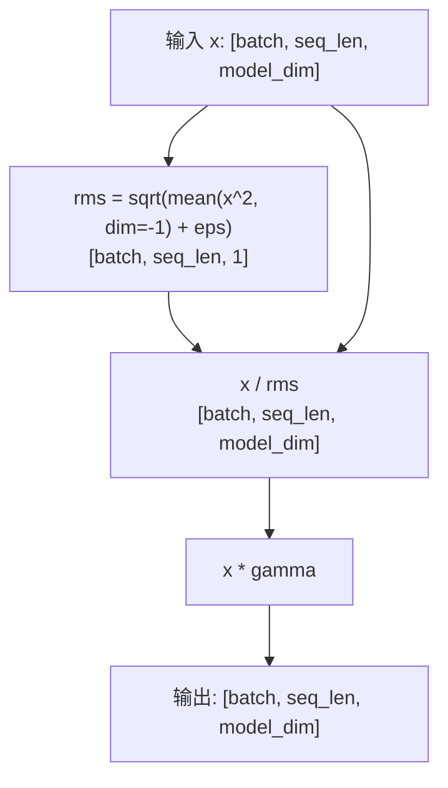

---

## 位置编码

### Rotary Position Embedding (RoPE)

#### 背景与动机

旋转位置编码（RoPE）通过旋转向量的方式注入位置信息，具有以下优势：
- **相对位置感知**：自动捕捉 token 之间的相对位置关系
- **外推能力**：可以处理比训练时更长的序列
- **计算高效**：通过逐元素乘法实现

目前被 LLaMA、Mistral、Qwen 等主流模型采用。

#### 核心公式

对于位置 $m$ 的向量 $x$，RoPE 将其旋转：

```math
\begin{bmatrix}
x_1' \\
x_2'
\end{bmatrix}
=
\begin{bmatrix}
\cos(m\theta) & -\sin(m\theta) \\
\sin(m\theta) & \cos(m\theta)
\end{bmatrix}
\cdot
\begin{bmatrix}
x_1 \\
x_2
\end{bmatrix}
```

展开形式：

$$x_1' = x_1 \cos(m\theta) - x_2 \sin(m\theta)$$

$$x_2' = x_1 \sin(m\theta) + x_2 \cos(m\theta)$$

其中 $\theta_i = 10000^{-2i/d}$

#### 实现原理

```
位置 m 的旋转角度: θ_m = m * θ_base
预计算 cos(m*θ) 和 sin(m*θ) 用于所有位置

旋转公式:
[x1', x2'] = [x1*cos - x2*sin, x1*sin + x2*cos]

等价于:
x' = x * cos + rotate_half(x) * sin
其中 rotate_half(x) = [-x后半, x前半]
```

#### 张量形状流程图

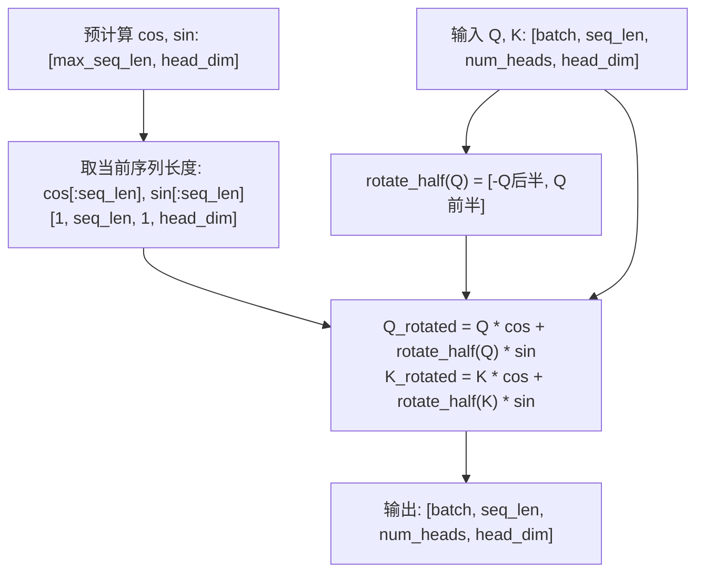

---

## 前馈网络

### FFN

#### 背景与动机

前馈网络（Feed-Forward Network）是 Transformer 中注意力层之后的两层全连接网络，用于对特征进行非线性变换。它是 Transformer 中参数量最大的部分。

#### 核心公式

$$\text{FFN}(x) = W_2 \cdot \text{ReLU}(W_1 x)$$

通常 $d_{ff} = 4 \times d_{model}$

#### 张量形状流程图

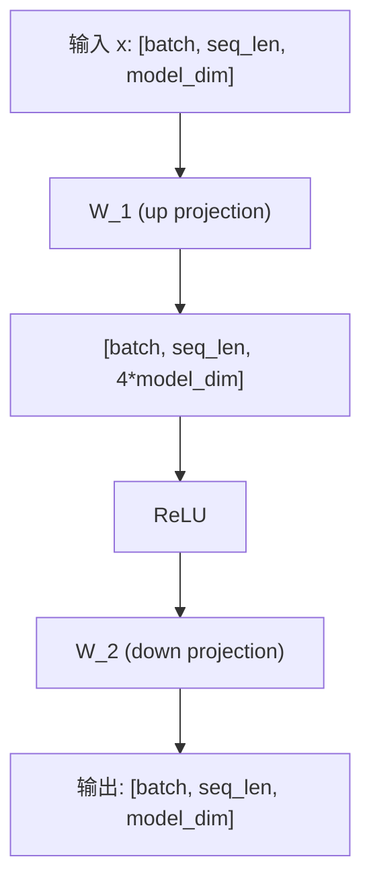

---

### SwiGLU

#### 背景与动机

SwiGLU 是 GLU（Gated Linear Unit）变体之一，被 LLaMA、PaLM 等模型采用。相比标准 FFN，SwiGLU 引入门控机制和 Swish 激活函数，提升了模型性能。

#### 核心公式

$$\text{SwiGLU}(x) = W_{down}\left(\text{SiLU}(W_{gate}(x)) \odot W_{up}(x)\right)$$

其中：
- $\text{SiLU}(x) = x \cdot \sigma(x)$ （也称为 Swish）
- $\odot$ 表示逐元素乘法

**参数量对比**：标准 FFN 有 2 个矩阵，SwiGLU 有 3 个矩阵

#### 张量形状流程图

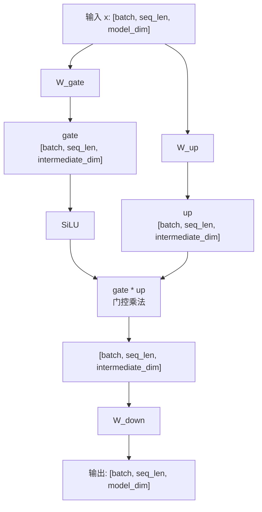

---

### Mixture of Experts

#### 背景与动机

混合专家模型（Mixture of Experts, MoE）通过稀疏激活实现模型容量的极大扩展。每个 token 只激活部分专家网络，使得总参数量可以很大，但计算量保持可控。

**核心思想**：
- Router 决定每个 token 应该由哪些专家处理
- Top-K 路由：每个 token 只激活 K 个专家
- 专家输出按路由权重加权求和

代表模型：Mixtral 8x7B、DeepSeek-V2、GPT-4 等。

#### 核心公式

$$\text{MoE}(x) = \sum_{i \in \text{TopK}} \text{softmax}(\text{router}(x))_i \cdot E_i(x)$$

#### 张量形状流程图

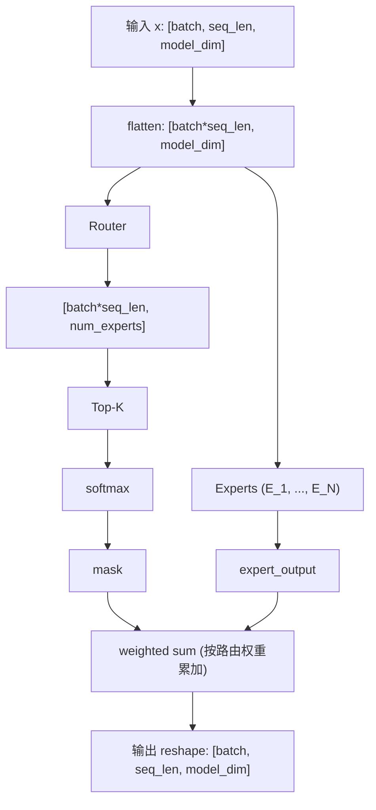

---

## 损失函数

### Pretrain Loss

#### 背景与动机

预训练损失（Pretrain Loss）是因果语言模型最基础的训练目标：给定当前位置之前的 token，预测下一个 token。除 padding 等需要忽略的位置外，序列中的所有 token 都参与损失计算。

这是所有 LLM 训练的基础，理解它是学习 SFT、DPO、PPO 等训练方法的前提。

#### 核心公式

$$\mathcal{L}_{\text{Pretrain}} = -\sum_{t=2}^{T} \log P(x_t \mid x_{<t})$$

#### 张量形状流程图

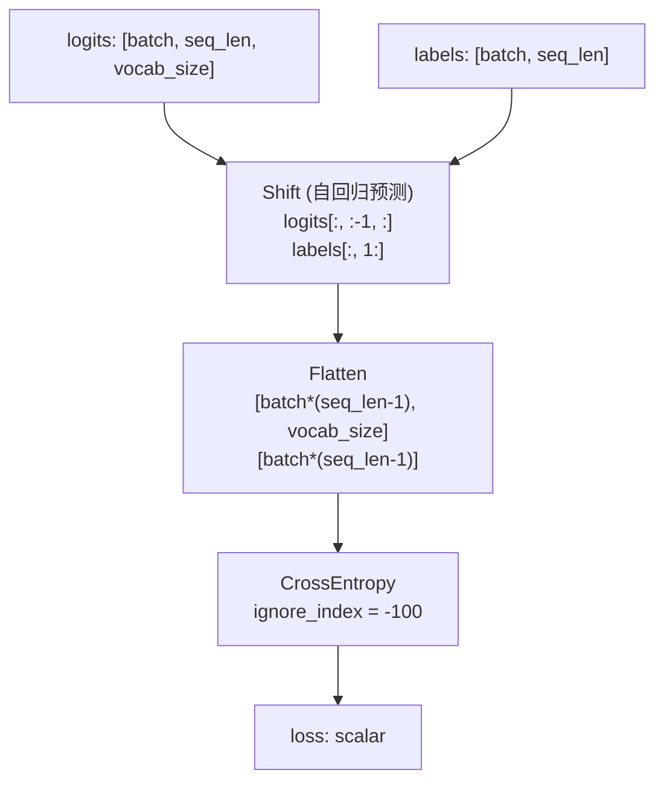

---

### SFT Loss

#### 背景与动机

监督微调（Supervised Fine-Tuning, SFT）损失是带 prompt 掩码的交叉熵损失。在指令微调中，通常只计算 response 部分的损失，不计算 prompt 部分。

如果只看损失函数的实现，SFT Loss 与 Pretrain Loss 的 next-token Cross Entropy 完全相同，唯一的实质差异是 **mask**：

| | Pretrain Loss | SFT Loss |
|---|---|---|
| 参与损失的 token | 所有未被忽略的 token | 仅 response token |
| prompt label | 正常参与损失 | 设为 `-100`，不参与损失 |
| Shift + CrossEntropy | 相同 | 相同 |

两者的训练阶段和数据形式不同，但损失计算的主干没有变化。

#### 核心公式

$$\mathcal{L}_{SFT} = -\sum_{t=p}^{T} \log P(y_t | x, y_{<t})$$

其中 $p$ 是 prompt 长度，即只对 response 部分计算损失。

#### 张量形状流程图

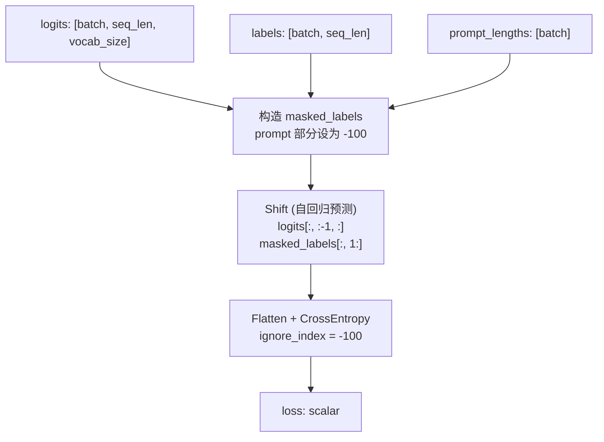

---

### DPO Loss

#### 背景与动机

直接偏好优化（Direct Preference Optimization, DPO）是一种无需奖励模型的 RLHF 替代方案。它直接在偏好数据上优化策略，简化了训练流程。

**核心思想**：增加 chosen 回答的概率，降低 rejected 回答的概率

#### 核心公式

$$\mathcal{L}_{DPO} = -\mathbb{E}\left[\log \sigma\left(\beta \left(\log \frac{\pi_\theta(y_w|x)}{\pi_{ref}(y_w|x)} - \log \frac{\pi_\theta(y_l|x)}{\pi_{ref}(y_l|x)}\right)\right)\right]$$

其中：
- $y_w$：chosen（优选）回答
- $y_l$：rejected（拒绝）回答
- $\pi_\theta$：当前策略
- $\pi_{ref}$：参考策略（通常是 SFT 模型）
- $\beta$：KL 散度约束系数

---

### PPO Loss

#### 背景与动机

近端策略优化（Proximal Policy Optimization, PPO）通过裁剪重要性采样比率来限制策略更新幅度，防止策略崩溃。是 RLHF 训练的核心算法。

#### 核心公式

$$\mathcal{L}_{PPO} = -\mathbb{E}\left[\min\left(r_t(\theta) \hat{A}_t, \text{clip}(r_t, 1-\epsilon, 1+\epsilon)\hat{A}_t\right)\right]$$

上式是供梯度下降最小化的 loss；论文中最大化的策略目标使用相反符号。

其中：
- $r_t = \frac{\pi_\theta(a_t|s_t)}{\pi_{\theta_{old}}(a_t|s_t)}$（重要性采样比率）
- $\hat{A}_t$：优势函数估计
- $\epsilon$：裁剪参数（通常 0.2）

#### 裁剪机制图解

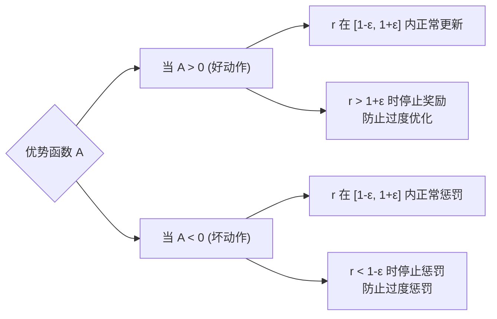

---

### GRPO Loss

#### 背景与动机

分组相对策略优化（Group Relative Policy Optimization, GRPO）是 DeepSeek-Math 提出的算法，被 DeepSeek-R1 用于强化学习训练。它通过组内相对优势来消除对价值网络（Critic）的依赖。

**核心思想**：
- 对同一问题生成多个回答（组）
- 在组内计算相对优势（而非绝对优势）
- 无需训练 Critic 网络，简化训练流程

#### 核心公式

**1. 组内相对优势（Group-Relative Advantage）**

对同一问题生成 $G$ 个回答，计算每个回答的奖励 $r_1, r_2, ..., r_G$，然后计算组内标准化优势：

$$\hat{A}_i = \frac{r_i - \text{mean}(\mathbf{r})}{\text{std}(\mathbf{r})}$$

**2. GRPO 损失函数**

$$\mathcal{L}_{GRPO} = -\mathbb{E}\left[\frac{1}{G}\sum_{i=1}^{G} \min\left(\rho_i \hat{A}_i, \text{clip}(\rho_i, 1-\epsilon, 1+\epsilon)\hat{A}_i\right) - \beta \cdot \mathbb{D}_{KL}\right]$$

其中：
- $\rho_i = \frac{\pi_\theta(o_i|q)}{\pi_{\theta_{old}}(o_i|q)}$（重要性采样比率）
- $\hat{A}_i$：组内相对优势
- $\beta$：KL 散度惩罚系数
- $\mathbb{D}_{KL}$：策略与参考策略的 KL 散度

#### 与 PPO 的区别

| 特性 | PPO | GRPO |
|------|-----|------|
| 优势估计 | 需要 Critic 网络 | 组内相对优势 |
| 额外网络 | 需要 Value Head | 不需要 |
| 内存占用 | 较高 | 较低 |
| 适用场景 | 通用 RL | 多候选生成场景 |

---

### 新增损失函数

| 损失 | 关键计算 | 需要说明的区别 |
|---|---|---|
| InfoNCE | 归一化特征的相似度矩阵、温度缩放、对角正样本 | 分母包含正样本；可选双向计算 |
| DAPO | token 级重要性比率、非对称 clipping | 全体有效 token 等权，长回答贡献更多 token |
| GSPO | 每条回答的平均 log ratio，再取 exp | 每条有效回答等权，序列级 clipping |
| KL k1 / k2 / k3 | log ratio、平方近似、控制变量估计 | 采样分布与 KL 方向必须明确，k2 一般有偏 |
| 软标签 CE | `-sum(target * log_softmax(logits))` | 与硬标签索引式 CE 的输入形状不同 |

具体 API、公式和验证方式见 [手撕题学习清单](docs/INTERVIEW_GUIDE.md)。

---

## 参数高效微调

### LoRA

#### 背景与动机

低秩适应（Low-Rank Adaptation, LoRA）通过在预训练权重旁添加低秩分解矩阵来实现参数高效微调。它冻结预训练权重，只训练少量参数，大大降低了微调成本。

**核心思想**：权重更新 $\Delta W$ 可以被低秩分解为 $B \cdot A$

#### 核心公式

$$h = W_0 x + \Delta W x = W_0 x + BAx$$

其中：
- $W_0 \in \mathbb{R}^{d \times k}$：冻结的预训练权重
- $A \in \mathbb{R}^{r \times k}$：可训练，使用随机初始化
- $B \in \mathbb{R}^{d \times r}$：可训练，初始化为零
- $r \ll \min(d, k)$：低秩维度

**关键设计**：$B$ 初始化为零，使得初始状态 $BA = 0$，保证微调开始时模型行为不变。

`LoRALinear.merged_linear()` 返回一个独立的合并线性层，可在 `eval()` 后用于推理。
原模块的权重与训练状态保留，梯度仍能通过冻结的基础分支传向输入。

#### 张量形状流程图

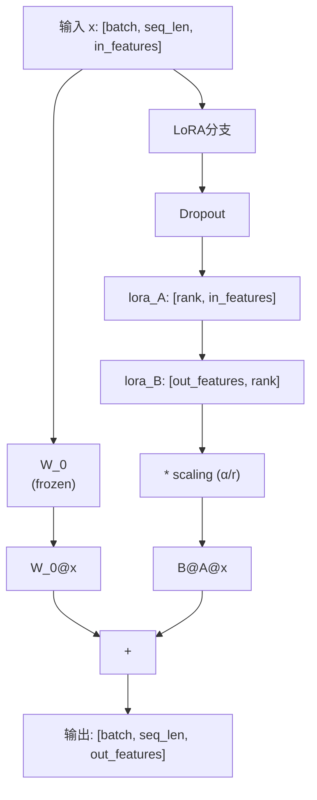

---

## 参考文献

### 注意力机制
- [Attention Is All You Need](https://arxiv.org/abs/1706.03762) - Transformer / MHA
- [GQA: Training Generalized Multi-Query Transformer Models](https://arxiv.org/abs/2305.13245) - GQA
- [DeepSeek-V2](https://arxiv.org/abs/2405.04434) - MLA

### 位置编码
- [RoFormer: Rotary Position Embedding](https://arxiv.org/abs/2104.09864) - RoPE

### 归一化
- [Layer Normalization](https://arxiv.org/abs/1607.06450)
- [Root Mean Square Layer Normalization](https://arxiv.org/abs/1910.07467)

### 前馈网络
- [GLU Variants Improve Transformer](https://arxiv.org/abs/2002.05202) - SwiGLU
- [Outrageously Large Neural Networks: The Sparsely-Gated Mixture-of-Experts Layer](https://arxiv.org/abs/1701.06538) - MoE
- [Mixtral of Experts](https://arxiv.org/abs/2401.04088) - MoE

### 训练方法
- [Direct Preference Optimization](https://arxiv.org/abs/2305.18290) - DPO
- [Proximal Policy Optimization](https://arxiv.org/abs/1707.06347) - PPO
- [DeepSeekMath](https://arxiv.org/abs/2402.03300) - GRPO
- [DeepSeek-R1](https://arxiv.org/abs/2501.12948) - GRPO
- [DAPO](https://arxiv.org/abs/2503.14476) - 非对称 clipping 与 token 归一化
- [Group Sequence Policy Optimization](https://arxiv.org/abs/2507.18071) - GSPO
- [Representation Learning with Contrastive Predictive Coding](https://arxiv.org/abs/1807.03748) - InfoNCE
- [Approximating KL Divergence](http://joschu.net/blog/kl-approx.html) - k1 / k2 / k3

### 参数高效微调
- [LoRA: Low-Rank Adaptation](https://arxiv.org/abs/2106.09685)

---

