# LLM 面试手撕代码大全

> 从基础算子到注意力、训练损失与生成：公式、张量形状和 PyTorch 实现。

## 目录

- [基础算子](#基础算子)
  - [Linear](#linear)
  - [Sigmoid 与 SiLU](#sigmoid-与-silu)
  - [Softmax 与 LogSoftmax](#softmax-与-logsoftmax)
  - [PyTorch 张量操作](#pytorch-张量操作)
- [注意力机制](#注意力机制)
  - [Scaled Dot-Product Attention](#scaled-dot-product-attention)
  - [Multi-Head Attention](#multi-head-attention)
  - [Group Query Attention](#group-query-attention)
  - [Multi-Head Latent Attention (MLA)](#multi-head-latent-attention-mla)
  - [Attention Mask](#attention-mask)
  - [KV Cache](#kv-cache)
- [归一化层](#归一化层)
  - [LayerNorm](#layernorm)
  - [RMSNorm](#rmsnorm)
- [位置编码](#位置编码)
  - [Rotary Position Embedding (RoPE)](#rotary-position-embedding-rope)
- [前馈网络](#前馈网络)
  - [FFN](#ffn)
  - [SwiGLU](#swiglu)
  - [Mixture of Experts](#mixture-of-experts)
- [损失函数](#损失函数)
  - [Cross Entropy](#cross-entropy)
  - [Pretrain Loss](#pretrain-loss)
  - [SFT Loss](#sft-loss)
  - [InfoNCE Loss](#infonce-loss)
  - [DPO Loss](#dpo-loss)
  - [PPO Loss](#ppo-loss)
  - [GRPO Loss](#grpo-loss)
  - [DAPO Loss](#dapo-loss)
  - [GSPO Loss](#gspo-loss)
  - [KL Divergence](#kl-divergence)
- [参数高效微调](#参数高效微调)
  - [LoRA](#lora)
- [分词](#分词)
  - [Byte-level BPE](#byte-level-bpe)
- [量化](#量化)
  - [INT8 量化](#int8-量化)
- [生成](#生成)
  - [生成采样](#生成采样)
- [工具调用](#工具调用)
  - [流式参数解析](#流式参数解析)
- [参考文献](#参考文献)

## 基础算子

### Linear

**背景与动机**

线性层是注意力投影和前馈网络的基础。它把每个位置的输入特征映射到新的特征空间；
同一个线性层在所有 token 位置共享参数。

**核心公式**

$$y=xW^T+b$$

其中，$x$ 是输入特征，$W$ 是可学习的权重，$b$ 是偏置。
PyTorch 按 `[out_features, in_features]` 存储 $W$，所以输入作为行向量时需要乘 $W^T$。

**实现思路**

用 `nn.Parameter` 注册权重与可选 bias，先计算 `x @ weight.T`，再通过广播加上 bias。
输入 `[..., in_features]` 变成 `[..., out_features]`，前导维度保持不变。

**代码：[Linear.py](components/Linear.py)**

### Sigmoid 与 SiLU

**背景与动机**

激活函数让网络能够表达非线性关系。Sigmoid 将数值压缩到 $(0,1)$，
SiLU 则用 Sigmoid 给输入提供平滑的门控，是 SwiGLU 的组成部分。

**核心公式**

$$\sigma(x)=\frac1{1+e^{-x}},\qquad \mathrm{SiLU}(x)=x\sigma(x)$$

Sigmoid 输出可以理解为门的开度：正输入接近全开，负输入接近关闭。
SiLU 将原输入与这个开度相乘，保留平滑的变化。

**实现思路**

先计算 Sigmoid，再用 `x * sigmoid(x)` 得到 SiLU。
为避免对很大的负输入计算 `exp(-x)`，Sigmoid 按符号选择等价的稳定表达式。
零点处两者的导数分别为 $1/4$ 和 $1/2$。

**代码：[Activation.py](components/Activation.py)**

### Softmax 与 LogSoftmax

**背景与动机**

分类和生成模型通常输出未经归一化的 logits。Softmax 把它们转换成和为 1 的概率，
LogSoftmax 直接给出对数概率，便于计算交叉熵。

**核心公式**

$$p_i=\frac{e^{z_i}}{\sum_j e^{z_j}}=\frac{e^{z_i-m}}{\sum_j e^{z_j-m}},\qquad m=\max_jz_j$$

$$\log p_i=z_i-m-\log\sum_j e^{z_j-m}$$

其中，$z_i$ 是第 $i$ 个类别的 logit，$p_i$ 是它的概率。
所有 logits 减去同一个常数，分子与分母的缩放会抵消，因此概率不变。
取最大值作为这个常数，可以让指数的输入不大于零。

**实现思路**

沿最后一维取最大值并相减，计算指数后除以指数和。
LogSoftmax 直接计算减去 Log-Sum-Exp 的结果，避免先得到接近零的概率再取 log。
两者都支持 `[B,C]`、`[B,T,C]` 等形状。

**代码：[EntropyLoss.py](loss/EntropyLoss.py)**

### PyTorch 张量操作

**背景与动机**

理解张量的形状和轴顺序，是理解 LLM 组件的基础。
Q、K、V 即使使用相同的操作，也会因为投影参数不同而得到不同表示。

**实现思路**

分头时将 `[B,T,D]` 重排为 `[B,T,H,d]`，再换轴为 `[B,H,T,d]`，其中 $D=Hd$。
合头时先恢复轴顺序，再重排回 `[B,T,D]`。
`transpose`、`permute` 改变轴顺序，`view` 受步长约束，`reshape` 在需要时会复制数据。
下方 Notebook 用示例解释这些操作与内存布局的关系。

**代码：[pytorch_tensor_reshape.ipynb](pytorch_tensor_reshape.ipynb)**

## 注意力机制

### Scaled Dot-Product Attention

**背景与动机**

缩放点积注意力是多头注意力的基础。Query 表示当前位置要寻找的信息，
Key 用于计算匹配程度，Value 提供最终被聚合的内容。

**核心公式**

$$\mathrm{Attention}(Q,K,V)=\mathrm{softmax}\left(\frac{QK^T}{\sqrt{d_k}}\right)V$$

其中，$QK^T$ 是每个 query 与各个 key 的匹配分数，$d_k$ 是 Q/K 的头维度。
在各维近似独立、零均值且单位方差时，点积方差随 $d_k$ 增长；
除以 $\sqrt{d_k}$ 能避免分数过大使 softmax 过早饱和。
最后乘 V，就是按照注意力权重对内容做加权求和。

**实现思路**

Q、K、V 分别为 `[B,H,Q,d_k]`、`[B,H,K,d_k]`、`[B,H,K,d_v]`。
先得到 `[B,H,Q,K]` 的分数，应用 mask，再沿 key 轴做 softmax，最后乘 V。
mask 统一使用 **True / 1 = 允许注意**；全屏蔽行的权重与输出为零。

自注意力的张量形状示意

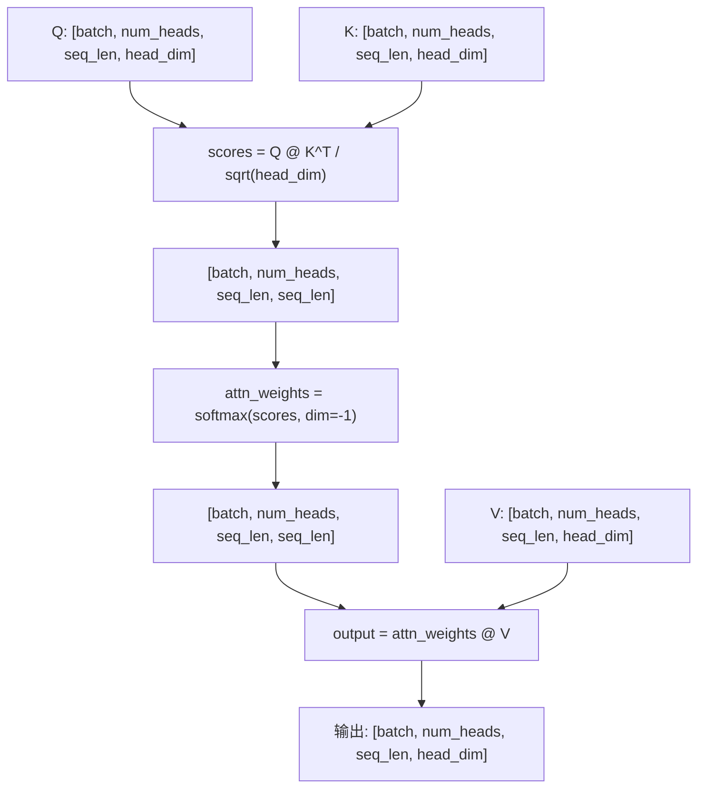

**代码：[ScaledDotProductAttention.py](attention/ScaledDotProductAttention.py)**

### Multi-Head Attention

**背景与动机**

一个注意力头只在一个表示子空间中计算匹配。多头注意力使用不同的投影参数，
让模型同时关注不同位置和不同类型的信息，再融合各头的结果。

**核心公式**

$$\mathrm{head}_i=\mathrm{Attention}(QW_i^Q,KW_i^K,VW_i^V)$$

$$\mathrm{MHA}(Q,K,V)=\mathrm{Concat}(\mathrm{head}_1,\ldots,\mathrm{head}_H)W^O$$

其中，$H$ 是头数，$W_i^Q,W_i^K,W_i^V$ 是第 $i$ 个头的投影，
$W^O$ 是输出投影。各头独立计算权重，拼接后恢复模型维度。

**实现思路**

按“线性投影 → 分头 → 缩放点积注意力 → 合头 → 输出投影”实现。
分头使用 `reshape` 后接 `transpose`，合头时执行相反的轴变换。
未传 `x_context` 时使用自注意力；传入时由 Query 输入与上下文分别生成 Q 和 K/V。
因果约束通过 mask 提供。

张量形状示意

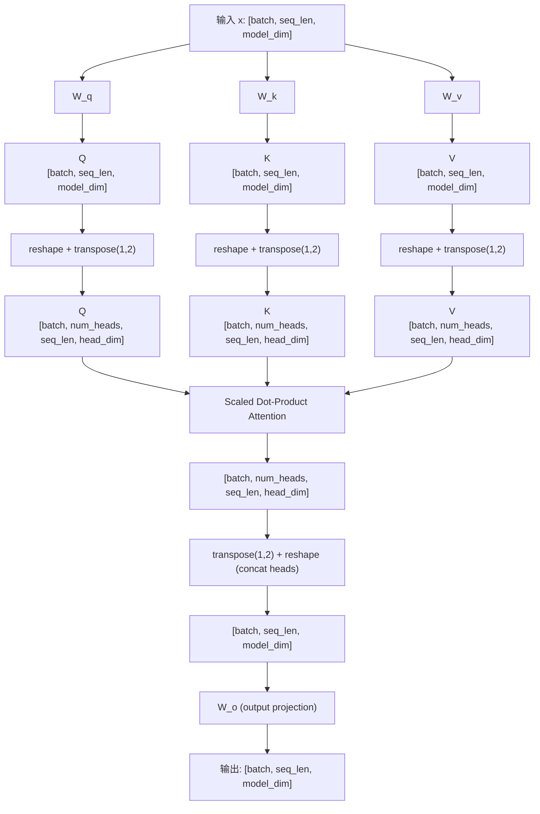

**代码：[MultiHeadAttention.py](attention/MultiHeadAttention.py)**

### Group Query Attention

**背景与动机**

生成过程中，每个注意力头都缓存 K/V 会占用较多显存。
GQA 让多个 Query 头共享一组 K/V，是 MHA 与 MQA 之间的折中。

**核心公式**

$$g(i)=\left\lfloor\frac{i}{H/G}\right\rfloor,\qquad
\mathrm{head}_i=\mathrm{Attention}(Q_i,K_{g(i)},V_{g(i)})$$

其中，$H$ 是 Query 头数，$G$ 是 K/V 头数，要求 $H$ 能被 $G$ 整除。
这里的头下标从 0 开始：$i=0,\ldots,H-1$，对应的 K/V 组下标为 $0,\ldots,G-1$。
每组 $H/G$ 个 Query 头共享 K/V，但各自的 Query 和注意力权重仍然不同。

| 类型 | Q 头数 | K/V 头数 | 相同头维度下的 KV 存储比例 |
|---|---|---|---|
| MHA | $H$ | $H$ | $1$ |
| GQA | $H$ | $G$ | $G/H$ |
| MQA | $H$ | $1$ | $1/H$ |

**实现思路**

先把 Q 投影成 H 个头，把 K/V 投影成 G 个头。
用 `repeat_kv` 将 `[B,G,T,d]` 按组扩展为 `[B,H,T,d]`，再复用标准注意力计算。
理解时重点观察“哪些 Query 头共享同一个 K/V 头”。

张量形状示意

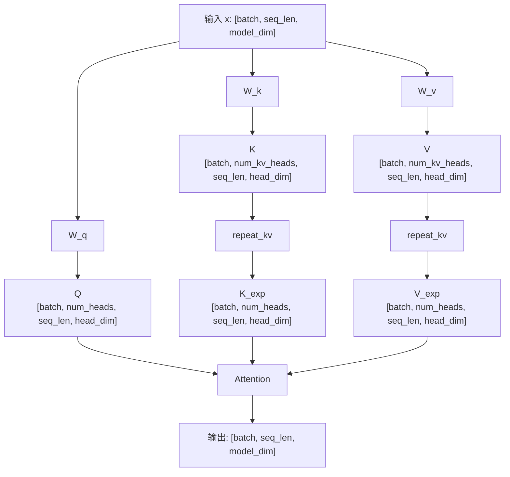

**代码：[GroupQueryAttention.py](attention/GroupQueryAttention.py)**

### Multi-Head Latent Attention (MLA)

**背景与动机**

MLA 用低维潜变量表达 K/V，希望减小缓存所需的表示。
与 GQA 的共享头不同，它利用低秩投影压缩特征空间。

**核心公式**

$$c_t^{KV}=W^{DKV}h_t,\qquad [k_t,v_t]=W^{UKV}c_t^{KV}$$

$$c_t^Q=W^{DQ}h_t,\qquad q_t=W^{UQ}c_t^Q$$

其中，$h_t$ 是 token 隐藏状态，$c_t^{KV}$ 和 $c_t^Q$ 是低维中间表示。
D 表示下投影，U 表示上投影；先压缩再恢复，使投影经过一个低秩瓶颈。

**实现思路**

本教学实现分别构造 Q 和 KV 的下投影、上投影，再拆分内容与 RoPE 特征进行注意力计算。
Q/K 的点积维度为 `head_dim + rope_dim`，V 的头维度为 `head_dim`。
文件保留核心张量变换；共享解耦 RoPE Key、投影吸收和增量潜变量缓存未在此实现。

张量形状示意

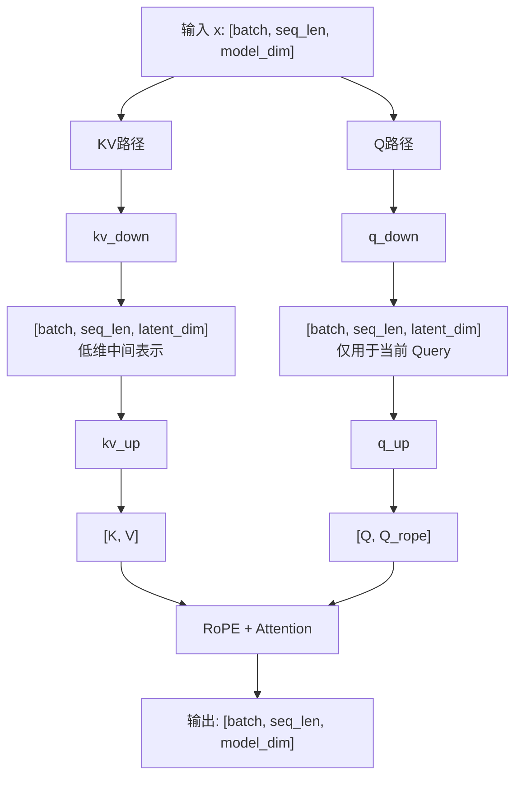

**代码：[MultiLatentAttention.py](attention/MultiLatentAttention.py)**

### Attention Mask

**背景与动机**

因果语言模型不能看到未来 token，补齐的 padding 也不应参与注意力。
mask 用一个允许矩阵，把这些规则写进注意力分数。

**核心公式**

$$M_{qk}^{causal}=\mathbf1[k\le past\_len+q]$$

$$M=M^{causal}\land M^{key\ padding}\land M^{query\ padding}$$

$q$ 是本轮 query 的相对下标，$k$ 是完整 key 序列的下标，$past\_len$ 是缓存长度。
$\mathbf1[\cdot]$ 表示条件成立时取 1；逻辑与表示同时满足各个约束。
例如已缓存 3 个 token，本轮输入 2 个 token，首行允许前 4 个 key，次行允许全部 5 个 key。

**实现思路**

Padding mask 从 `input_ids != pad_token_id` 构造，causal mask 用位置比较构造。
合并后得到可广播到各头的 `[B,1,Q,K]`，**True / 1 表示允许注意**。
缓存解码的 `input_ids` 包含历史和本轮 token；默认同时屏蔽 padding query，
`mask_query_padding=False` 时只屏蔽 padding key。

**代码：[AttentionMask.py](attention/AttentionMask.py)**

### KV Cache

**背景与动机**

自回归生成只追加新 token。历史 token 的 K/V 已经计算过，
缓存后可以避免每轮重复投影整个前缀，并让新 Query 直接关注历史内容。

**核心公式**

$$K_{cache}'=\mathrm{Concat}(K_{cache},K_{new}),\qquad
V_{cache}'=\mathrm{Concat}(V_{cache},V_{new})$$

$$O_{new}=\mathrm{Attention}(Q_{new},K_{cache}',V_{cache}')$$

Concat 沿序列维追加，新 Query 只对应本轮输入。
缓存保存已经应用位置编码的 K 和对应 V，因此旧 K 不应被重复旋转。

**实现思路**

首轮 prefill 计算完整输入的 K/V；后续 decode 只计算新 Q/K/V。
RoPE 使用 `offset=past_len`，因果 mask 同样按历史长度偏移。
`forward` 返回 `(output, (K, V))`，缓存形状为 `[B,H,T,d]`。
在 `eval()` 下，完整前向与逐 token / 分块解码的结果应一致。

**代码：[MultiHeadAttentionWithKVCache.py](attention/MultiHeadAttentionWithKVCache.py)**

## 归一化层

### LayerNorm

**背景与动机**

LayerNorm 对每个位置的特征做归一化，帮助稳定特征尺度。
它沿特征维计算统计量，不依赖同一 batch 中的其他样本，适合序列模型。

**核心公式**

$$\mu=\frac1d\sum_i x_i,\qquad \sigma^2=\frac1d\sum_i(x_i-\mu)^2$$

$$\mathrm{LN}(x)=\gamma\frac{x-\mu}{\sqrt{\sigma^2+\epsilon}}+\beta$$

其中，$d$ 是特征维度，$\mu$ 和 $\sigma^2$ 是该位置的均值与总体方差。
$\epsilon$ 避免分母为零，$\gamma$ 与 $\beta$ 是可学习的缩放和偏移，
让模型在归一化后仍能调整表示的尺度与中心。

**实现思路**

沿最后一维分别计算 mean 和 var，保留维度便于广播。
方差使用 `unbiased=False`，然后依次中心化、缩放、应用仿射参数。
半精度统计量提升到 FP32，输入和输出的形状相同。

张量形状示意

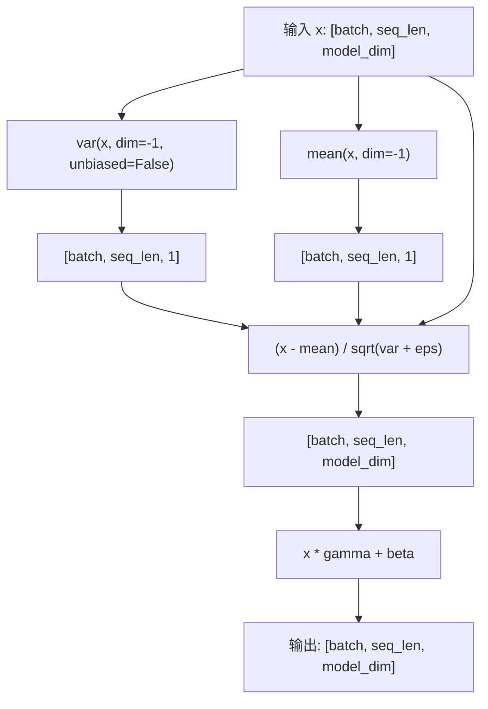

**代码：[LayerNorm.py](normalization/LayerNorm.py)**

### RMSNorm

**背景与动机**

RMSNorm 简化 LayerNorm，只根据均方根控制特征尺度，省去减均值的步骤。
它保留缩放能力，计算也更直接。

**核心公式**

$$\mathrm{RMSNorm}(x)=\gamma\frac{x}{\sqrt{\frac1d\sum_i x_i^2+\epsilon}}$$

分母是带稳定项的均方根，$d$ 是特征维度，$\gamma$ 是可学习缩放。
与 LayerNorm 相比，RMSNorm 不进行中心化，也没有偏移参数 $\beta$。

**实现思路**

按“平方 → 求均值 → 加 $\epsilon$ → 开方 → 归一化 → 乘 $\gamma$”实现。
也可以用 `rsqrt` 直接得到分母的倒数。半精度统计量在 FP32 中计算。

张量形状示意

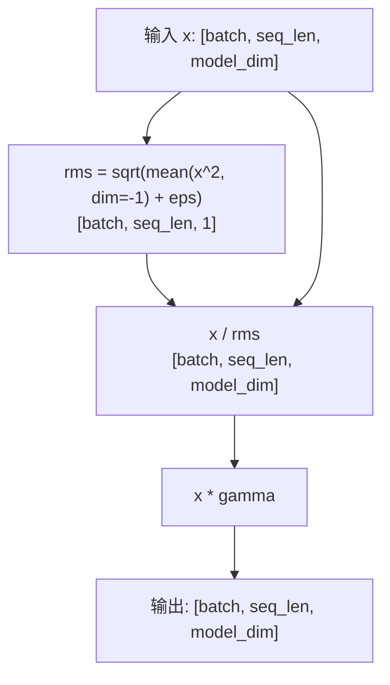

**代码：[RMSNorm.py](normalization/RMSNorm.py)**

## 位置编码

### Rotary Position Embedding (RoPE)

**背景与动机**

注意力的点积本身不知道 token 的先后位置。RoPE 把位置编码为 Q/K 的旋转，
使两个位置的点积能够反映它们的相对距离。

**核心公式**

$$\begin{bmatrix}x_1'\\x_2'\end{bmatrix}=
\begin{bmatrix}\cos(m\theta_i)&-\sin(m\theta_i)\\
\sin(m\theta_i)&\cos(m\theta_i)\end{bmatrix}
\begin{bmatrix}x_1\\x_2\end{bmatrix},\qquad \theta_i=10000^{-2i/d}$$

$$x'=x\odot\cos(m\theta)+\mathrm{rotate\_half}(x)\odot\sin(m\theta)$$

其中，$m$ 是绝对位置，$d$ 是头维度，$\theta_i$ 为不同特征对提供不同旋转频率。
位置 m 与 n 的旋转向量做点积时，旋转角度的差取决于 $m-n$。
$\odot$ 表示逐元素乘法。

**实现思路**

本实现把前后半区的特征配对，`rotate_half(x) = [-x后半, x前半]`，所以头维度为偶数。
先构造位置与频率的外积，再取 cos / sin，应用到 `[B,T,H,d]` 的 Q/K。
缓存解码用 `offset=past_len` 选择位置，频率表按需要扩展。

张量形状示意

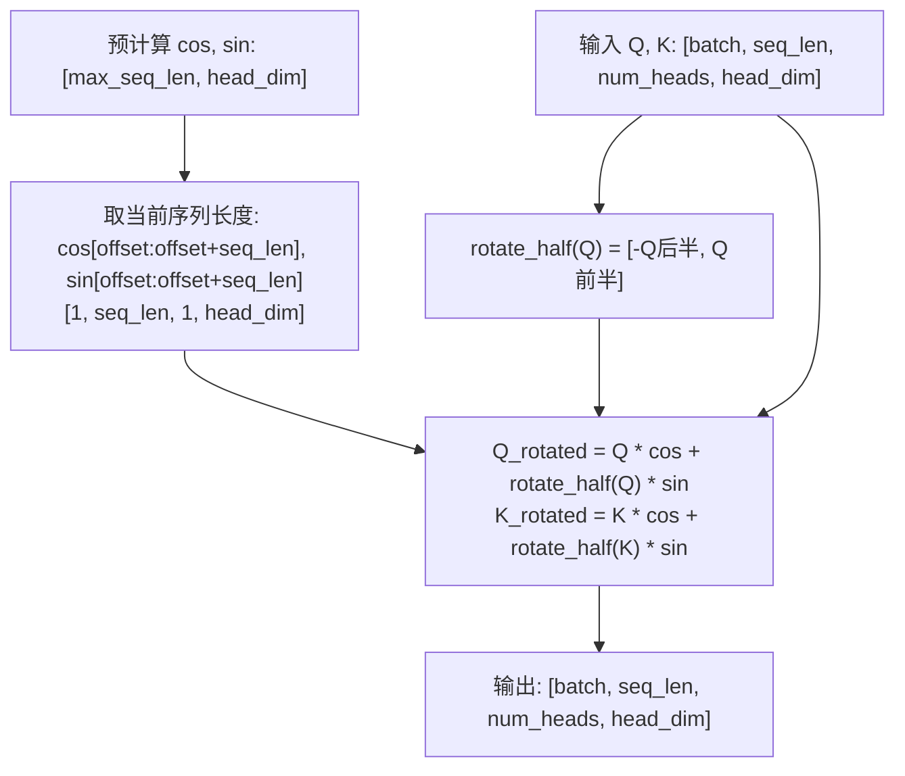

**代码：[RotaryEmbedding.py](position/RotaryEmbedding.py)**

## 前馈网络

### FFN

**背景与动机**

注意力负责不同 token 之间的信息交互，FFN 则对每个 token 的特征做非线性变换。
它先扩展到更大的中间空间，再投影回模型维度。

**核心公式**

$$\mathrm{FFN}(x)=W_2\mathrm{ReLU}(W_1x+b_1)+b_2$$

$W_1$ 是上投影，$W_2$ 是下投影，$b_1,b_2$ 是偏置。
ReLU 提供非线性，否则两层线性变换仍可合成一层线性变换。

**实现思路**

形状依次为 `[B,T,D] → [B,T,I] → [B,T,D]`，I 是 `intermediate_dim`，常见取值为 4D。
同一组参数应用于所有 token，不在此层混合序列位置。

张量形状示意

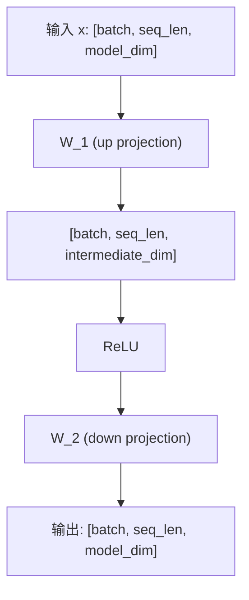

**代码：[FFN.py](ffn/FFN.py)**

### SwiGLU

**背景与动机**

SwiGLU 为 FFN 加入一条门控分支，让模型根据输入决定哪些中间特征应该保留。
它使用 SiLU，使门控的变化更加平滑。

**核心公式**

$$\mathrm{SwiGLU}(x)=W_{down}\left(\mathrm{SiLU}(W_{gate}x)\odot W_{up}x\right)$$

$W_{gate}$ 生成门控特征，$W_{up}$ 生成内容特征，$\odot$ 表示逐元素相乘，
$W_{down}$ 将结果恢复到模型维度。SiLU 应作用在 gate 分支上。

**实现思路**

gate 和 up 两条分支都产生 `[B,T,I]`，门控相乘后经 down 投影得到 `[B,T,D]`。
本实现使用三个无 bias 矩阵。忽略 bias，参数量约为 $3DI$；
取 $I\approx8D/3$，可与中间维度 4D 的普通 FFN 对齐参数量。

张量形状示意

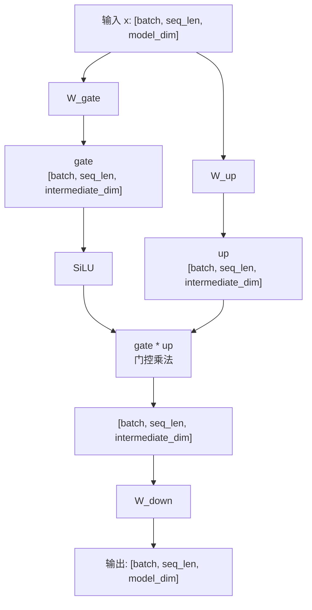

**代码：[SwiGLUFFN.py](ffn/SwiGLUFFN.py)**

### Mixture of Experts

**背景与动机**

MoE 用多个专家网络扩大模型容量，但每个 token 只激活其中少数专家。
Router 根据输入选择专家，最终输出是被选中专家结果的加权和。

**核心公式**

$$S=\mathrm{TopK}(g(x)),\qquad w_i=\frac{e^{g_i(x)}}{\sum_{j\in S}e^{g_j(x)}}$$

$$\mathrm{MoE}(x)=\sum_{i\in S}w_iE_i(x)$$

$g(x)$ 是 Router 的 logits，S 是选中的专家集合，$E_i$ 是第 i 个专家。
本实现仅在选中专家之间做 softmax，因此它们的权重和为 1。

**实现思路**

先展平为 `[B*T,D]`，计算路由 logits 并取 Top-k，再分派 token、加权累加专家输出。
最后恢复 `[B,T,D]`。这里的 Top-k 选择专家，生成采样中的 Top-k 选择词表 token。
当前归一化方式在 `top_k=1` 时权重恒为 1，任务损失对 Router 的梯度为零。

张量形状示意

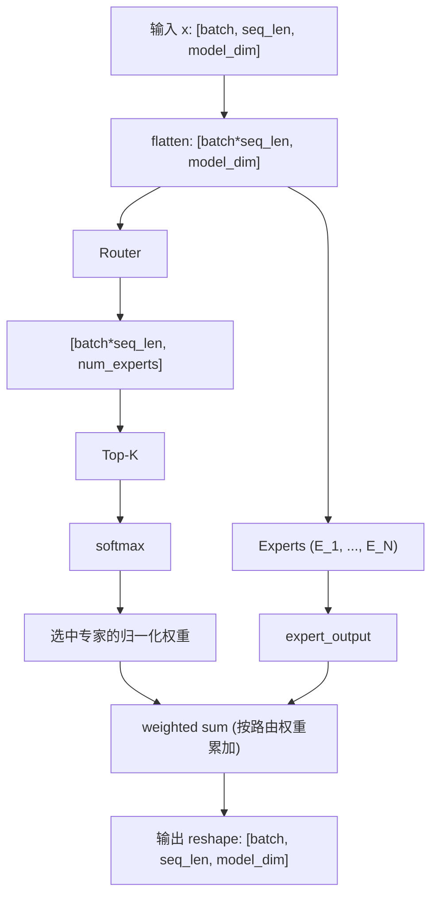

**代码：[MoE.py](ffn/MoE.py)**

## 损失函数

### Cross Entropy

**背景与动机**

交叉熵衡量模型预测分布与目标之间的差异。硬标签指定一个正确类别，
软标签则给出完整的目标概率分布，可用于蒸馏或标签平滑。

**核心公式**

$$\mathrm{CE}(z,y)=-\log p_y,\qquad p=\mathrm{softmax}(z)$$

$$\mathrm{CE}(z,q)=-\sum_jq_j\log p_j$$

z 是模型的 logits，y 是正确类别下标，q 是目标分布。
硬标签相当于 one-hot 分布，只有正确类别的项保留下来。
正确类别的预测概率越高，负 log 概率越小。

**实现思路**

先做 LogSoftmax；硬标签用 `gather` 取目标类别，软标签做逐类加权求和。
logits 为 `[...,C]`，硬标签为 `[...]`，软标签为 `[...,C]`。
`ignore_index=-100` 用于忽略硬标签位置；`mean` 仅除以有效位置数，
`sum` 求和，`none` 保留逐位置损失。

**代码：[EntropyLoss.py](loss/EntropyLoss.py)**

### Pretrain Loss

**背景与动机**

因果语言模型通过预测下一个 token 学习语言。
当前位置的 logits 对应下一位置的标签，所以损失计算的第一步是错开一位。

**核心公式**

$$\mathcal L_{pretrain}=-\frac1N\sum_{b,t}m_{bt}\log P(x_{b,t+1}\mid x_{b,\le t})$$

$m_{bt}$ 标记需要训练的位置，$N=\sum m$ 是有效预测 token 数。
条件概率表示根据当前及之前的 token 预测下一 token，取负 log 后按有效 token 求平均。

**实现思路**

将 `logits[:, :-1, :]` 与 `labels[:, 1:]` 对齐，再展平并计算交叉熵。
labels 中的 `-100` 不参与损失；全忽略时返回可反传的零。
输入 logits 为 `[B,T,V]`，labels 为 `[B,T]`。

张量形状示意

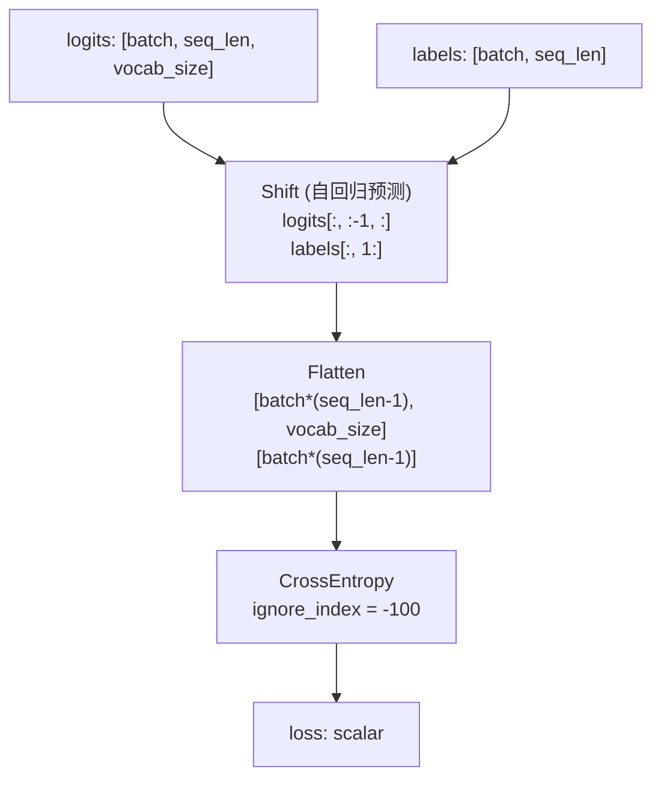

**代码：[PretainLoss.py](loss/PretainLoss.py)**

### SFT Loss

**背景与动机**

指令微调通常只要求模型学会生成回答，不要求它重复学习 prompt。
SFT 与预训练使用相同的 next-token 交叉熵，区别在于哪些标签参与损失。

**核心公式**

$$\mathcal L_{SFT}=-\frac1{N_{response}}\sum_{b,t}m^{response}_{bt}\log P(x_{b,t+1}\mid x_{b,\le t})$$

$m^{response}$ 只保留有效 response 标签，$N_{response}$ 是这些标签的数量。
这是在回答位置计算条件负对数似然，再按有效回答 token 求平均。

**实现思路**

先把 prompt 的 labels 设为 `-100`，保留已有的 padding 忽略标记，再做 shift。
非空 prompt 长度为 $p\ge1$ 时，`labels[:,p]` 是首个 response token，
由 `logits[:,p-1,:]` 预测；先 mask 再 shift 可以避免边界错位。

张量形状示意

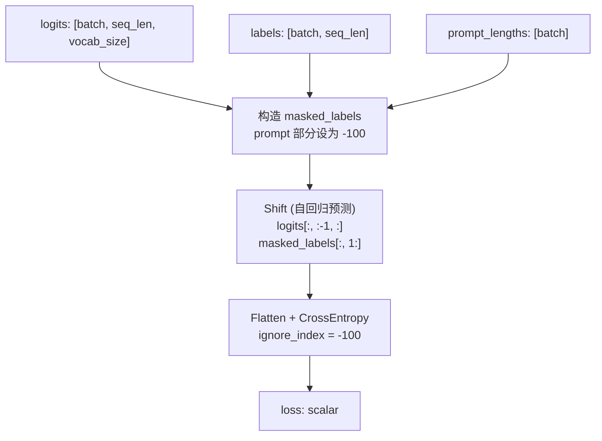

**代码：[SFTLoss.py](loss/SFTLoss.py)**

### InfoNCE Loss

**背景与动机**

对比学习希望正样本的表示接近、负样本的表示分离。
InfoNCE 把“在一批候选中找出匹配样本”转成一个分类问题。

**核心公式**

$$s_{ij}=\frac{\langle\hat q_i,\hat k_j\rangle}{\tau},\qquad
\mathcal L=-\frac1B\sum_i\log\frac{e^{s_{ii}}}{\sum_je^{s_{ij}}}$$

$\hat q_i,\hat k_j$ 是归一化的特征，$\tau$ 是温度，B 是批大小。
第 i 对样本是正样本，因此相似度矩阵的对角线是正确类别；分母包含正样本和批内负样本。
较小的温度让模型更强调相似度差异。

**实现思路**

输入两组 `[B,D]` 特征，先 L2 归一化，再计算 `queries @ keys.T / temperature`。
对 `[B,B]` 相似度矩阵做交叉熵，目标为 `arange(B)`。
`symmetric=True` 平均两个检索方向的损失。

**代码：[InfoNCELoss.py](loss/InfoNCELoss.py)**

### DPO Loss

**背景与动机**

DPO 直接利用成对的偏好数据训练模型。给定同一 prompt 的 chosen 与 rejected，
它希望当前策略相对参考策略更偏好 chosen，无需单独训练奖励模型。

**核心公式**

$$\Delta=\log\frac{\pi_\theta(y_w|x)}{\pi_{ref}(y_w|x)}-
\log\frac{\pi_\theta(y_l|x)}{\pi_{ref}(y_l|x)}$$

$$\mathcal L_{DPO}=-\mathbb E[\log\sigma(\beta\Delta)]$$

$y_w$ 是 chosen，$y_l$ 是 rejected，$\pi_\theta$ 是当前策略，$\pi_{ref}$ 是参考策略。
$\Delta$ 衡量当前策略相对参考策略的偏好变化；增大它会减小损失。
$\beta$ 是正则化强度参数，改变参考策略约束与偏好优化之间的权衡。

**实现思路**

输入四组 `[B]` 序列 log 概率：策略与参考模型各自的 chosen / rejected。
先做两组策略与参考的差，再做 chosen 与 rejected 的差，最后用 `-logsigmoid(beta * delta)`。
回答的有效 token log 概率需在调用前聚合；实现也支持标签平滑。

**代码：[DPOLoss.py](loss/DPOLoss.py)**

### PPO Loss

**背景与动机**

策略更新过大可能让训练不稳定。PPO 比较新旧策略对同一动作的概率，
用裁剪后的代理目标限制过度更新。

**核心公式**

$$r_t=\exp(\log\pi_{new,t}-\log\pi_{old,t})$$

$$\mathcal L_{PPO}=-\mathbb E\left[\min\left(r_tA_t,
\mathrm{clip}(r_t,1-\epsilon,1+\epsilon)A_t\right)\right]$$

$r_t$ 是重要性采样比率，$A_t$ 是优势，$\epsilon$ 控制裁剪区间。
正优势表示应该提高动作概率，负优势表示应该降低概率。
取 min 选择较保守的收益；前面的负号把“最大化收益”转成“最小化损失”。

**实现思路**

计算 ratio、clipped_ratio、两个代理目标，再取逐元素最小值并求负均值。
正优势限制比率上界，负优势限制下界；不能把所有超出区间的比率都简单替换成 clip 值。

裁剪机制示意

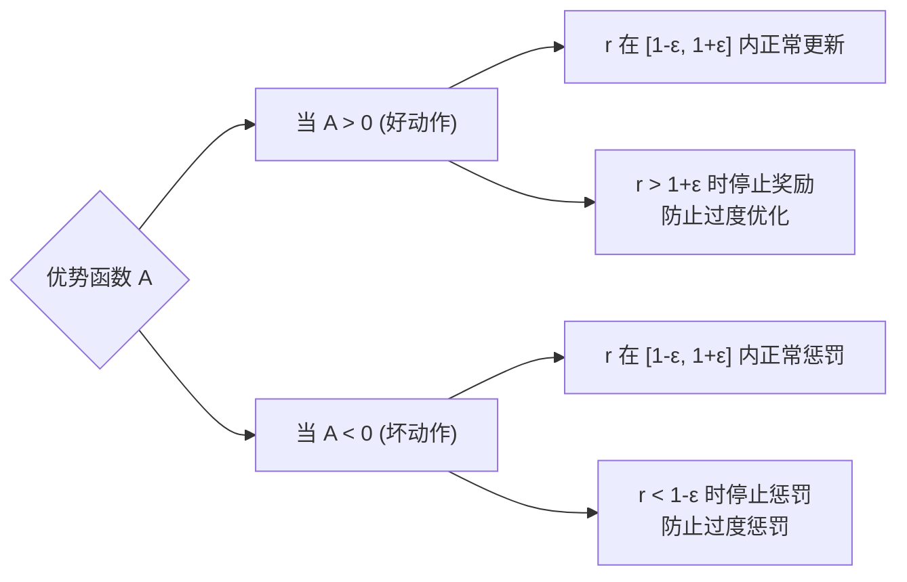

**代码：[PPOLoss.py](loss/PPOLoss.py)**

### GRPO Loss

**背景与动机**

GRPO 对同一个 prompt 生成一组回答，用组内奖励的相对高低估计优势。
这种方法不需要额外的价值网络，再复用 PPO 风格的裁剪目标更新策略。

**核心公式**

$$A_i=\frac{R_i-\mathrm{mean}(R)}{\mathrm{std}(R)+\epsilon}$$

$$\mathcal L_{GRPO}=-\mathrm{mean}\left[\min(rA,\mathrm{clip}(r,1-\epsilon_c,1+\epsilon_c)A)\right]
+\beta\,\mathrm{mean}(KL)$$

$R_i$ 是同一组中的回答奖励，标准化后得到组内优势 $A_i$。
$\epsilon$ 是稳定项，$\epsilon_c$ 是裁剪幅度；r 是新旧策略概率比，$\beta$ 控制 KL 惩罚。
奖励高于组均值时优势为正，低于组均值时为负。

**实现思路**

`compute_grpo_advantages` 对 `[B,G]` 奖励沿组维求均值与总体标准差。
`grpo_loss` 对同形状的 log 概率与优势逐元素计算裁剪目标，再求平均；
提供 `ref_kl` 时加入 KL 项。此基础函数不接收 response mask，
变长回答需要调用者明确 token / 序列的归约方式。

**代码：[GRPOLoss.py](loss/GRPOLoss.py)**

### DAPO Loss

**背景与动机**

DAPO 的损失核心采用 token 级重要性采样，并把裁剪上下界分开设置。
较宽的上界可以给正优势动作留下更大的概率提升空间。

**核心公式**

$$r_{it}=\exp(\log\pi_{new,it}-\log\pi_{old,it})$$

$$\mathcal L_{DAPO}=-\frac{\sum_{i,t}m_{it}\min(r_{it}A_{it},
\mathrm{clip}(r_{it},1-\epsilon_{low},1+\epsilon_{high})A_{it})}{\sum_{i,t}m_{it}}$$

i 表示回答，t 表示 token，$m_{it}$ 标记有效 response token。
$\epsilon_{low}$ 与 $\epsilon_{high}$ 分别控制下界和上界。
分母是全体有效 token 数，因此每个有效 token 等权，长回答贡献更多项。

**实现思路**

old / new log 概率为 `[B,T]`，优势可为 `[B]`、`[B,1]` 或 `[B,T]`。
将序列优势广播到 token，计算 ratio 与非对称 clip，再按 mask 求和并除以有效 token 数。
默认裁剪参数为 0.2 / 0.28；旧策略和优势作为 rollout 数据 detach。
文件覆盖损失核心，动态采样等流程由训练系统负责。

**代码：[DAPOLoss.py](loss/DAPOLoss.py)**

### GSPO Loss

**背景与动机**

回答的整体质量通常由序列级奖励衡量。GSPO 先构造一个长度归一化的序列比率，
再对整条回答做裁剪，避免直接连乘 token 比率产生强烈的长度影响。

**核心公式**

$$s_i=\exp\left(\frac1{L_i}\sum_tm_{it}(\log\pi_{new,it}-\log\pi_{old,it})\right),\qquad L_i=\sum_tm_{it}$$

$$\mathcal L_{GSPO}=-\frac1{B_{valid}}\sum_{i:L_i>0}
\min(s_iA_i,\mathrm{clip}(s_i,1-\epsilon_{low},1+\epsilon_{high})A_i)$$

$L_i$ 是回答的有效长度，$A_i$ 是该回答的优势，$B_{valid}$ 是非空回答数量。
$s_i$ 是 token 比率的几何平均，既不是算术平均，也不是未归一化的连乘。
最终每条非空回答等权，而不是每个 token 等权。

**实现思路**

输入 old / new log 概率 `[B,T]` 和优势 `[B]`。
先按 mask 求平均 log ratio，再取 exp、裁剪，最后对非空回答求平均。
默认裁剪参数为 `3e-4` / `4e-4`；旧策略与优势 detach。

| 对比 | DAPO | GSPO |
|---|---|---|
| 比率与裁剪 | token 级 | 序列级 |
| 归约权重 | 有效 token 等权 | 非空回答等权 |

**代码：[GSPOLoss.py](loss/GSPOLoss.py)**

### KL Divergence

**背景与动机**

KL 散度衡量两个概率分布的差异，可用于约束策略偏离参考模型的程度。
需要区分“完整类别分布的精确计算”和“对已采样 token 的估计”。

**核心公式**

$$D_{KL}(P\Vert Q)=\sum_jP_j(\log P_j-\log Q_j)$$

$$l=\log Q(x)-\log P(x),\qquad x\sim P$$

$$k_1=-l,\qquad k_2=\tfrac12l^2,\qquad k_3=e^l-1-l$$

P 是采样或被约束的策略，Q 是参考分布，KL 方向为 $P\Vert Q$。
k1 的期望为 KL，但单样本可为负；k2 是局部平方近似，一般有偏。
k3 加入控制变量，在实际从 P 采样及相应支撑条件下无偏；`expm1(l)-l` 能减少近零相消误差。

**实现思路**

精确 KL 先求两组 LogSoftmax，按 P 的概率对 log 概率差加权，沿类别求和后对分布求平均。
采样 KL 根据 log 概率差直接计算所选估计器，再按 mask 归约。
采样方向决定估计含义；对估计值做自动求导不自动等于精确 KL 对策略参数的梯度。

**代码：[EntropyLoss.py](loss/EntropyLoss.py) · [KLDivergence.py](loss/KLDivergence.py)**

## 参数高效微调

### LoRA

**背景与动机**

微调完整线性层需要训练较多参数。LoRA 冻结基础权重，
用两个小矩阵表示低秩更新，只训练旁路参数。

**核心公式**

$$y=W_0x+\frac\alpha rBAx,\qquad W_{merged}=W_0+\frac\alpha rBA$$

$W_0$ 是冻结的基础权重，A 为 `[r,in_features]`，B 为 `[out_features,r]`。
r 是秩，$\alpha/r$ 是缩放系数；旁路参数量为 $r(in+out)$，通常远小于完整权重的 $in\times out$。
A 随机初始化、B 初始化为零，使微调开始时输出与基础层一致。

**实现思路**

分别计算基础分支和 `B(A(x))`，缩放后相加。
基础权重冻结，但输入仍应保留梯度，以便传回前层。
推理时在 `eval()` 下用 `merged_linear()` 得到独立的合并线性层；此时 dropout 已关闭。

张量形状示意

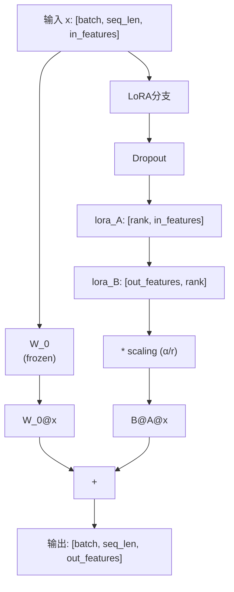

**代码：[LoRALinear.py](peft/LoRALinear.py)**

## 分词

### Byte-level BPE

**背景与动机**

逐字符分词的序列较长，固定词表又难以覆盖新词。
BPE 反复合并高频相邻符号，让常见片段使用一个 token，同时保留表示罕见内容的能力。

**核心公式**

$$pair^*=\arg\max_{(a,b)}\mathrm{count}(a,b),\qquad (a,b)\rightarrow ab$$

count 是训练语料中相邻 token 对的出现次数。
每轮选择高频对并合并，记录规则的先后顺序；编码新文本时按学习到的 merge rank 使用规则。

**实现思路**

从 256 个 UTF-8 byte token 开始，统计相邻对、选择合并、更新语料与词表。
基础 byte 词表能覆盖中文、英文、空格、换行和 emoji，训练样本之间不跨边界合并。
解码时先拼接全部 token 字节再统一 UTF-8 解码，因为单个 byte token 可能不是完整字符。

**代码：[BPE.py](tokenizer/BPE.py)**

## 量化

### INT8 量化

**背景与动机**

量化把浮点值映射到较少位数的整数，用更小的存储近似表示原张量。
scale 控制相邻整数对应的浮点间隔，zero point 表示浮点零对应的整数。

**核心公式**

$$q=\mathrm{clamp}(\mathrm{round}(x/s)+z),\qquad \hat x=(q-z)s$$

x 是原值，q 是量化整数，$\hat x$ 是反量化近似，s 是 scale，z 是 zero point。
round 带来舍入误差，clamp 保证结果落在整数范围内。

| 模式 | 整数范围 | scale | zero point |
|---|---|---|---|
| 对称 | $[-127,127]$ | $\max|x|/127$ | $0$ |
| 非对称 | $[-128,127]$ | $(x_{max}-x_{min})/255$ | 裁剪后的 $\mathrm{round}(-128-x_{min}/s)$ |

**实现思路**

对称模式用最大绝对值确定范围；非对称模式先把最小/最大值范围扩展到包含零，再求 s 和 z。
按公式量化成 `torch.int8`，返回整数值、scale 和 zero point；反量化时按相反顺序还原。
全零张量使用合法的非零 scale。本文件采用逐张量量化。

**代码：[Quantization.py](components/Quantization.py)**

## 生成

### 生成采样

**背景与动机**

每一步生成都要从词表分布中选出下一个 token。
贪婪解码直接选最大概率，随机采样则通过温度和候选过滤调节输出多样性。

**核心公式**

$$p_i=\mathrm{softmax}(z/\tau)_i$$

z 是词表 logits，$\tau>0$ 是温度。较低温度让分布更集中，较高温度让分布更平缓。
Top-k 保留固定数量候选；Top-p 保留概率降序后累计达到阈值的最小前缀，候选数随分布变化。

**实现思路**

按“温度缩放 → Top-k → Top-p → softmax → multinomial”实现。
过滤候选时将其 logits 设为 `-inf`，跨过 Top-p 阈值的 token 仍要保留。
`greedy=True` 使用 argmax；随机采样可传 `torch.Generator` 复现结果。
`sample_logits` 返回 `logits.shape[:-1]` 的 token IDs，不修改原 logits。

**代码：[Sampling.py](generation/Sampling.py)**

## 工具调用

### 流式参数解析

**背景与动机**

工具调用的 JSON 参数可能分多次到达，多条调用也可能交错。
解析时应按调用索引分别维护状态，直到参数完整后才转换成字典。

**实现思路**

用 `output_index` 关联调用事件，并登记 `item_id`、`call_id` 和名称。
收到 `response.output_item.added` 时登记调用信息，收到
`response.function_call_arguments.delta` 时累积片段，收到
`response.function_call_arguments.done` 时用 `json.loads` 解析完整参数。

`feed(event)` 返回刚完成的调用或 `None`；`finish()` 检查是否还有未完成调用。
`parse_tool_calls(events)` 返回按索引排序的 `ToolCall` 列表，包含名称、调用 ID 和参数。
解析完成后，再由调用者执行对应工具。

**代码：[ToolCallParser.py](tools/ToolCallParser.py)**

## 参考文献

展开参考论文

**注意力机制**

- [Attention Is All You Need](https://arxiv.org/abs/1706.03762) - Transformer / MHA
- [GQA: Training Generalized Multi-Query Transformer Models](https://arxiv.org/abs/2305.13245) - GQA
- [DeepSeek-V2](https://arxiv.org/abs/2405.04434) - MLA

**位置编码**

- [RoFormer: Rotary Position Embedding](https://arxiv.org/abs/2104.09864) - RoPE

**归一化**

- [Layer Normalization](https://arxiv.org/abs/1607.06450)
- [Root Mean Square Layer Normalization](https://arxiv.org/abs/1910.07467)

**前馈网络**

- [GLU Variants Improve Transformer](https://arxiv.org/abs/2002.05202) - SwiGLU
- [Outrageously Large Neural Networks: The Sparsely-Gated Mixture-of-Experts Layer](https://arxiv.org/abs/1701.06538) - MoE
- [Mixtral of Experts](https://arxiv.org/abs/2401.04088) - MoE

**训练方法**

- [Direct Preference Optimization](https://arxiv.org/abs/2305.18290) - DPO
- [Proximal Policy Optimization](https://arxiv.org/abs/1707.06347) - PPO
- [DeepSeekMath](https://arxiv.org/abs/2402.03300) - GRPO
- [DeepSeek-R1](https://arxiv.org/abs/2501.12948) - GRPO
- [DAPO](https://arxiv.org/abs/2503.14476) - 非对称 clipping 与 token 归一化
- [Group Sequence Policy Optimization](https://arxiv.org/abs/2507.18071) - GSPO
- [Representation Learning with Contrastive Predictive Coding](https://arxiv.org/abs/1807.03748) - InfoNCE
- [Approximating KL Divergence](http://joschu.net/blog/kl-approx.html) - k1 / k2 / k3

**参数高效微调**

- [LoRA: Low-Rank Adaptation](https://arxiv.org/abs/2106.09685)

